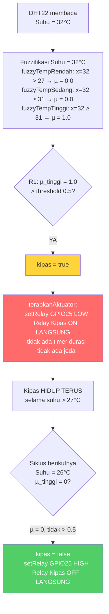
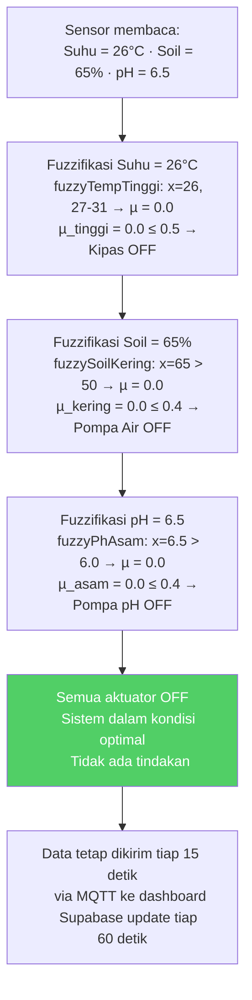
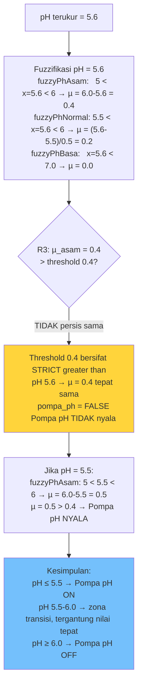
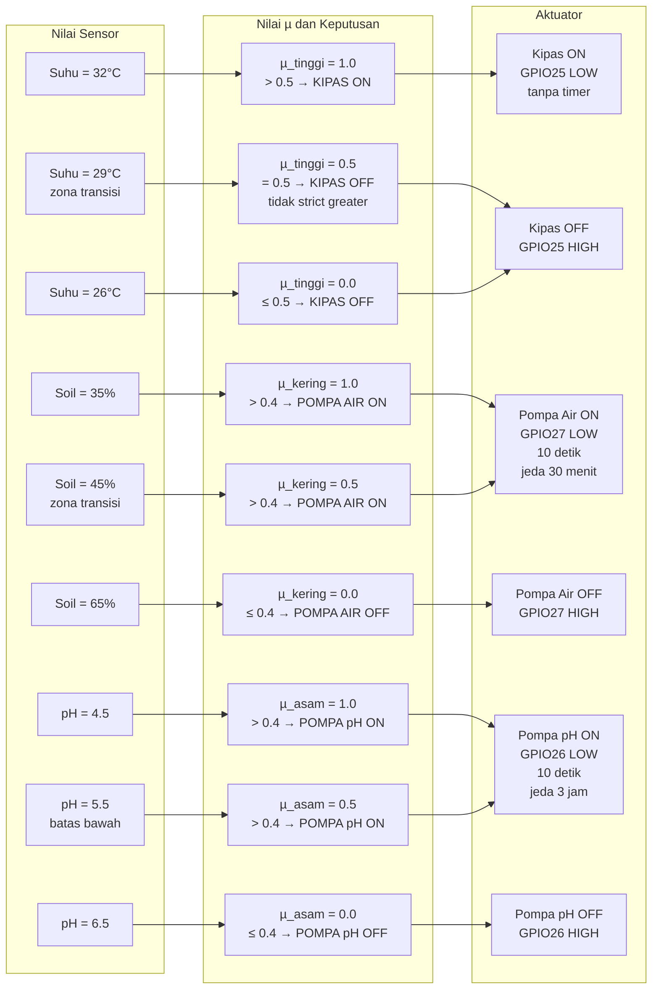

# Alur Keputusan Aktuator — Contoh Nyata End-to-End

---

## Contoh 1: pH Asam → Pompa pH Menyala

**Kondisi sensor:** pH = 5.2, Soil = 60%, Suhu = 26°C

```mermaid
flowchart TD
    A["Sensor pH membaca ADC = 950
    Trimmed Mean 150 sampel"] --> B

    B["adcToPH: ADC 950
    Segmen ADC 689–1082 → pH 6.86–4.01
    pH = 6.86 + (950-689)/(1082-689) × (4.01-6.86)
    pH = 6.86 + 0.664 × (-2.85)
    phRaw = 4.97"] --> C

    C["Kompensasi suhu 26°C
    phComp = 4.97 - (0.003 × 1 × -2.03)
    phComp = 4.97 + 0.006 = 4.976 ≈ 4.98"] --> D

    D["Kalman Filter
    kfEst = 4.98 → phOutput = 4.98"] --> E

    E["Fuzzifikasi pH = 4.98
    fuzzyPhAsam: x=4.98 < 5.0 → µ = 1.0
    fuzzyPhNormal: x=4.98 < 5.5 → µ = 0.0
    fuzzyPhBasa: x=4.98 < 7.0 → µ = 0.0"] --> F

    F{"R3: µ_asam = 1.0
    > threshold 0.4
    DAN pH > 0?"} -->|YA| G

    G["pompa_ph = true
    reqPompaPH = true"] --> H

    H{"tickPompa:
    pompaPHOffTime == 0
    atau jeda 3 jam habis?"} -->|YA pertama kali| I

    I["setRelay GPIO26 LOW
    Relay Pompa pH ON
    pompaPHNyala = true
    flagRelayBerubah = true"] --> J

    J["insertSupabase SEGERA
    relay_ph = 1"] --> K

    K["10 detik berlalu"] --> L

    L["setRelay GPIO26 HIGH
    Relay Pompa pH OFF
    pompaPHOffTime = now
    Mulai hitung jeda 3 jam
    flagRelayBerubah = true"] --> M

    M["insertSupabase SEGERA
    relay_ph = 0"]

    style I fill:#ff6b6b,color:#fff
    style L fill:#51cf66,color:#fff
    style G fill:#ffd43b
```

---

## Contoh 2: Tanah Kering → Pompa Air Menyala

**Kondisi sensor:** Soil = 35%, pH = 6.5, Suhu = 26°C

```mermaid
flowchart TD
    A["Sensor Soil membaca ADC = 2600
    Trimmed Mean 50 sampel"] --> B

    B["map ADC ke persen:
    map(2600, KERING=2900, BASAH=1139, 0, 100)
    pct = (2900-2600)/(2900-1139) × 100
    pct = 300/1761 × 100 = 17%
    
    Kalman: soilKfEst = 35%
    (akumulasi beberapa siklus)"] --> C

    C["Fuzzifikasi Soil = 35%
    fuzzySoilKering: x=35 ≤ 40 → µ = 1.0
    fuzzySoilLembab: x=35 ≤ 40 → µ = 0.0
    fuzzySoilBasah:  x=35 ≤ 70 → µ = 0.0"] --> D

    D{"R2: µ_kering = 1.0
    > threshold 0.4
    DAN soil > 0?"} -->|YA| E

    E["pompa_air = true
    reqPompaAir = true"] --> F

    F{"tickPompa:
    pompaAirOffTime == 0
    atau jeda 30 menit habis?"} -->|YA pertama kali| G

    G["setRelay GPIO27 LOW
    Relay Pompa Air ON
    pompaAirNyala = true
    pompaAirOnTime = now
    flagRelayBerubah = true"] --> H

    H["insertSupabase SEGERA
    relay_air = 1"] --> I

    I["10 detik berlalu"] --> J

    J["setRelay GPIO27 HIGH
    Relay Pompa Air OFF
    pompaAirOffTime = now
    Mulai hitung jeda 30 menit
    flagRelayBerubah = true"] --> K

    K["insertSupabase SEGERA
    relay_air = 0"] --> L

    L{"Siklus berikutnya
    soil masih kering
    DAN belum 30 menit?"} -->|YA| M

    M["reqPompaAir = true
    TAPI tickPompa cek:
    now - pompaAirOffTime < 30 menit"] --> N

    N["cdAir = sisa detik
    Relay TIDAK nyala
    Tunggu jeda habis"]

    style G fill:#ff6b6b,color:#fff
    style J fill:#51cf66,color:#fff
    style E fill:#ffd43b
    style N fill:#868e96,color:#fff
```

---

## Contoh 3: Suhu Tinggi → Kipas Menyala

**Kondisi sensor:** Suhu = 32°C, Soil = 65%, pH = 6.5

---

## Contoh 4: Kondisi Normal → Semua Aktuator OFF

**Kondisi sensor:** Suhu = 26°C, Soil = 65%, pH = 6.5

---

## Contoh 5: pH di Zona Transisi (Sebagian Asam)

**Kondisi sensor:** pH = 5.6 (antara Asam dan Normal)

---

## Ringkasan Tabel Keputusan Semua Aktuator

---

## Batas Nilai Sensor untuk Setiap Aktuator

| Sensor | Nilai | µ | Aktuator | Status |
|--------|-------|---|----------|--------|
| Suhu | < 27°C | µ_tinggi = 0 | Kipas | OFF |
| Suhu | 27–31°C | µ_tinggi = 0–1 | Kipas | OFF jika µ ≤ 0.5 |
| Suhu | **> 28.5°C** | µ_tinggi **> 0.5** | Kipas | **ON** |
| Suhu | ≥ 31°C | µ_tinggi = 1.0 | Kipas | ON penuh |
| Soil | > 50% | µ_kering = 0 | Pompa Air | OFF |
| Soil | 40–50% | µ_kering = 0–1 | Pompa Air | OFF jika µ ≤ 0.4 |
| Soil | **< 46%** | µ_kering **> 0.4** | Pompa Air | **ON** |
| Soil | ≤ 40% | µ_kering = 1.0 | Pompa Air | ON penuh |
| pH | > 6.0 | µ_asam = 0 | Pompa pH | OFF |
| pH | 5.0–6.0 | µ_asam = 0–1 | Pompa pH | OFF jika µ ≤ 0.4 |
| pH | **< 5.6** | µ_asam **> 0.4** | Pompa pH | **ON** |
| pH | ≤ 5.0 | µ_asam = 1.0 | Pompa pH | ON penuh |

> **Batas kritis:**
> - Kipas menyala saat suhu **> 28.5°C**
> - Pompa Air menyala saat kelembaban tanah **< 46%**
> - Pompa pH menyala saat pH **< 5.6**

---

*File ini fokus pada logika keputusan aktuator dengan contoh nilai nyata.*
*Untuk pipeline sensor lengkap lihat: `penjelasan_sensor_ph.md`*
*Untuk diagram sistem lengkap lihat: `diagram_sistem.md`*
