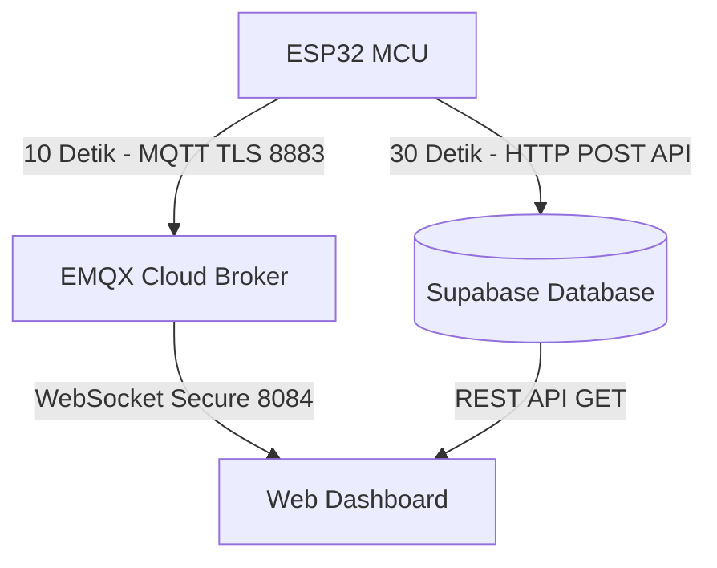

# Analisis Lengkap Sistem Greenhouse Cabai Rawit

Sistem ini adalah sistem pemantauan (monitoring) dan kontrol otomatis untuk greenhouse tanaman **Cabai Rawit (*Capsicum frutescens*)** menggunakan mikrokontroler **ESP32**. Sistem mengintegrasikan pembacaan berbagai sensor lingkungan dengan logika kecerdasan buatan berbasis **Fuzzy Tahani (Mamdani)** untuk mengendalikan aktuator secara real-time. Data dikirim ke dashboard web melalui protokol **MQTT** dan disimpan ke database **Supabase** secara periodik.

---

## 1. Arsitektur Fisik & Sensor

Sistem menggunakan tiga parameter utama untuk menentukan kondisi optimal tanaman cabai rawit:
*   **Kelembaban Tanah**: Optimal di kisaran 50% - 70%.
*   **pH Tanah**: Optimal di kisaran 6 - 7.
*   **Suhu Udara**: Optimal di kisaran 24°C - 28°C.

### Rincian Modul Perangkat Keras dan Pin GPIO
| Komponen | Deskripsi | GPIO ESP32 | Hubungan Elektrikal & Detail Sinyal |
| :--- | :--- | :--- | :--- |
| **DHT22** | Sensor suhu & kelembaban udara | **GPIO 4** | Menggunakan modul 3-pin dengan resistor pull-up internal pada PCB data. |
| **Soil Moisture** | Sensor kelembaban tanah | **GPIO 35 (ADC1_CH7)** | Membaca output analog (AO) dari modul probe. Menggunakan kalibrasi `DRY_VALUE` (3200) dan `WET_VALUE` (1500) yang disesuaikan untuk tipe kapasitif/anti-karat. |
| **pH Sensor & DMS** | Probe pH tanah + driver DMS | **GPIO 34 (ADC1_CH6)** (ADC pH)<br>**GPIO 13** (DMS Enable) | Kabel biru ke GPIO 13 (aktif LOW untuk menyalakan modul DMS), kabel ungu ke GPIO 34 (input analog pH). |
| **LED Indikator** | Indikator kondisi tanah kering | **GPIO 2** | Menyala (HIGH) jika kelembaban tanah di bawah 50%. |
| **Relay Blower** | Aktuator kipas sirkulasi udara | **GPIO 25** | Aktif-LOW (dikontrol berdasarkan hasil fuzzy suhu). |
| **Relay Air** | Aktuator pompa air penyiraman | **GPIO 26** | Aktif-LOW (dikontrol berdasarkan hasil fuzzy tanah). |
| **Relay pH** | Aktuator pompa koreksi pH (asam/basa) | **GPIO 27** | Aktif-LOW (dikontrol berdasarkan hasil fuzzy pH). |

---

## 2. Analisis Logika Kontrol: Fuzzy Tahani (Mamdani)

Sistem mengadopsi kontrol logika **Fuzzy Mamdani (metode Tahani)** dengan 3 jalur kontrol terpisah. Setiap jalur mengikuti siklus:
$$\text{Fuzzifikasi Input} \rightarrow \text{Evaluasi Aturan (IF-THEN)} \rightarrow \text{Implikasi MIN \& Agregasi MAX} \rightarrow \text{Defuzzifikasi Centroid} \rightarrow \text{Keputusan Aktuator}$$

Defuzzifikasi dilakukan dengan membagi domain keluaran $[0,1]$ menjadi 20 langkah (*STEPS = 20*). Aktuator akan aktif (**ON**) jika nilai centroid $\ge 0.5$ (didefinisikan sebagai `RELAY_FUZZY_THRESHOLD` di firmware dan `FUZZY_THRESHOLD` di dashboard).

### Jalur 1: Kontrol Blower (Suhu Udara)
*   **Fuzzifikasi Input (Suhu):**
    *   **Rendah**: `trapmf(tempC, 0, 0, 24, 27)`
    *   **Sedang**: `trimf(tempC, 24, 27, 31)`
    *   **Tinggi**: `trapmf(tempC, 27, 31, 45, 45)`
*   **Keanggotaan Output (Intensitas Blower):**
    *   **Rendah**: `trapmf(y, 0, 0, 0.15, 0.45)`
    *   **Sedang**: `trimf(y, 0.15, 0.35, 0.55)`
    *   **Tinggi**: `trapmf(y, 0.45, 0.65, 1.0, 1.0)`
*   **Aturan Fuzzy:**
    *   *IF* suhu Rendah *THEN* Blower Rendah
    *   *IF* suhu Sedang *THEN* Blower Sedang
    *   *IF* suhu Tinggi *THEN* Blower Tinggi

### Jalur 2: Kontrol Pompa Air (Kelembaban Tanah)
*   **Fuzzifikasi Input (Tanah %):**
    *   **Kering**: `trapmf(x, 0, 0, 40, 50)`
    *   **Lembab**: `trapmf(x, 40, 50, 70, 80)`
    *   **Basah**: `trapmf(x, 70, 80, 100, 100)`
*   **Aturan Fuzzy:**
    *   *IF* Tanah Kering *THEN* Pompa Tinggi (siram maksimal)
    *   *IF* Tanah Lembab *THEN* Pompa Rendah (siram minimal/mati)
    *   *IF* Tanah Basah *THEN* Pompa Rendah (pompa mati)

### Jalur 3: Kontrol Koreksi pH (pH Tanah)
*   **Fuzzifikasi Input (pH):**
    *   **Asam**: `trapmf(ph, 3, 3, 5, 6)`
    *   **Netral**: `trapmf(ph, 5.5, 6, 7, 7.5)`
    *   **Basa**: `trapmf(ph, 7, 7.5, 9, 9)`
*   **Aturan Fuzzy:**
    *   *IF* pH Asam *THEN* Koreksi Tinggi (butuh penambahan larutan basa/dolomit)
    *   *IF* pH Netral *THEN* Koreksi Rendah (kondisi aman, pompa mati)
    *   *IF* pH Basa *THEN* Koreksi Tinggi (butuh penambahan larutan asam)

---

## 3. Penanganan Sensor & Solusi Gangguan Elektrikal (1 Wadah)

Salah satu keunggulan teknis dari sistem ini adalah penanganan interferensi arus ketika probe pH dan probe kelembaban tanah diletakkan di dalam media/wadah yang sama, serta minimalisasi efek penuaan sensor.

### 1. Elektrolisis & Polarisasi Sensor Kelembapan Tanah (Masalah Drift Nilai)
Pada sensor kelembaban tanah jenis resistif (misalnya FC-28), pembacaan yang dibiarkan menyala terus-menerus (*always-on*) akan mengalami penurunan nilai persentase yang signifikan (misalnya dari $78\%$ menjadi $52\%$ dalam waktu 10 menit) meskipun kondisi tanah diam dan tidak berubah. Fenomena ini disebabkan oleh dua hal:
1.  **Elektrolisis**: Arus searah (DC) yang mengalir terus-menerus melalui tanah basah memicu reaksi elektrokimia pada permukaan probe logam, membentuk lapisan oksida isolator (korosi) pada kaki anoda.
2.  **Polarisasi Elektrikal**: Ion-ion bermuatan di dalam tanah berkumpul di sekitar elektroda sensor, menciptakan gaya gerak listrik (GGL) lawan yang meningkatkan resistansi total sirkuit. Kenaikan resistansi ini dibaca oleh ADC ESP32 sebagai kondisi tanah yang "semakin kering", sehingga nilai persentase kelembaban tanah yang terpetakan terus menurun drastis.

### 2. Solusi Manajemen Daya Sensor (*Duty Cycling*)
Untuk mengatasi elektrolisis dan polarisasi tersebut, firmware menerapkan sistem **Gated Power (Duty Cycling)**:
-   **Skema Operasi**: Daya VCC untuk sensor tanah tidak dihubungkan langsung ke tegangan konstan ($3.3\text{V}$), melainkan dikontrol melalui pin digital ESP32 (`SOIL_PWR_PIN`, misalnya **GPIO 12**).
-   **Duty Cycle Rendah**: Sensor hanya dinyalakan (`soilPowerSet(true)`) sesaat sebelum pembacaan dilakukan selama kurang lebih $300\text{ ms}$ ($150\text{ ms}$ waktu tunggu stabilisasi sirkuit + $150\text{ ms}$ pengambilan sampel ADC), dan segera dimatikan kembali (`soilPowerSet(false)`) setelah data didapatkan.
-   **Manfaat**: Dengan siklus loop total sekitar $12$ detik dan sensor hanya menyala selama $300\text{ ms}$, siklus aktif (*active duty cycle*) hanya berkisar **$2.5\%$**. Hal ini berhasil menghentikan proses polarisasi ion secara instan, menstabilkan nilai kelembaban tanah tanpa *drift*, serta memperpanjang usia pakai sensor (mencegah karat dini).

### 3. Solusi Gangguan Elektrikal 1 Wadah (pH vs Soil Moisture)
Ketika tanah basah, arus listrik dari sensor kelembaban tanah mengalir melalui media tanah dan mengganggu probe pH tanah yang sangat sensitif (meningkatkan pembacaan pH palsu sekitar $0.5$ hingga $1.0\text{ pH}$).
-   **Hardware Gating**: Saat ESP32 melakukan pembacaan pH, sensor kelembaban tanah dipastikan mati (`soilPowerSet(false)`) sehingga tidak ada arus bocor di tanah.
-   **Jeda Stabilisasi**: Setelah mematikan sensor tanah, sistem menunggu $8\text{ detik}$ (`PH_SETTLE_MS`) agar sisa muatan di tanah benar-benar hilang sebelum membaca ADC pH. Sebaliknya, setelah pembacaan pH selesai, sistem menunggu jeda $1.5\text{ detik}$ (`SOIL_AFTER_PH_MS`) sebelum membaca kelembaban tanah.
-   **Software Bias Correction (Cadangan)**: Jika fitur hardware power gating dinonaktifkan (`SOIL_PWR_PIN = -1`), firmware secara otomatis mengaktifkan algoritma koreksi dengan memotong bias pembacaan pH sebesar `PH_BIAS_WET_SOIL` ($0.9\text{ pH}$) apabila kelembaban tanah terdeteksi basah ($\ge 35\%$).

### 4. Validasi & Filter Kestabilan pH
Untuk mencegah pembacaan palsu atau tindakan aktuator yang salah saat probe pH dicabut atau terjadi interferensi noise:
-   **Penyaringan Nilai ADC**: Pembacaan dianggap tidak valid jika nilai ADC sangat rendah ($<80$), sangat tinggi ($>4050$), atau memiliki rentang fluktuasi sampel (spread) $>220$.
-   **Penyaringan Rentang Fisik**: Nilai pH yang valid dibatasi secara logis antara $3.0$ hingga $9.0$.
-   **Mekanisme Hold (Tahan Nilai)**: Jika terjadi kegagalan pembacaan singkat, sistem akan menahan (*hold*) nilai pH valid terakhir selama maksimal 2 siklus (`PH_HOLD_MAX_INVALID = 2`) sebelum menampilkan status terputus (`--`) di dashboard.

### 5. Algoritma Trimmed Mean (Rata-Rata Terpangkas) untuk Penyetabil ADC
Guna mengatasi noise inheren pada ADC internal ESP32 (akibat fluktuasi riak tegangan WiFi/MQTT), fungsi [bacaAdcRata](file:///d:/TA/git%20ta/index.ino#L167-L203) ditingkatkan dengan menerapkan filter **Trimmed Mean (Rata-Rata Terpangkas)**:
1.  **Pengumpulan Sampel**: Program mengambil $N$ buah sampel analog secara berurutan ($N=15$ untuk tanah, $N=25$ untuk pH) dengan jeda $8\text{ ms}$.
2.  **Pengurutan (*Sorting*)**: Sampel-sampel tersebut diurutkan secara menaik menggunakan algoritma *Insertion Sort*.
3.  **Pemangkasan Nilai Ekstrim**: Sebanyak $20\%$ nilai terkecil (ekstrim bawah) dan $20\%$ nilai terbesar (ekstrim atas) dibuang dari data sisa. Ini secara efektif mengeliminasi lonjakan (*spike*) noise akibat lonjakan arus transmisi WiFi.
4.  **Rata-Rata Tengah**: Sisa data di bagian tengah ($60\%$ dari total sampel) dirata-ratakan untuk mendapatkan nilai pembacaan yang sangat stabil dan bebas dari pencilan (*outliers*).

### 6. Filter Hierarki Hibrida & Logika Penundaan Tancap 1-Siklus (Stabilisasi Dashboard)
Untuk memastikan pembacaan kelembaban tanah di dashboard instan dan stabil tanpa lompatan transien (100% $\rightarrow$ 78%) maupun perayapan lambat dari bawah (14% $\rightarrow$ 60%), firmware menerapkan **Hierarchical Hybrid Filter** di loop utama:
1.  **Deteksi Tancap Instan dengan Penundaan 1-Siklus**:
    *   Saat sensor baru ditancapkan (perubahan dari $0\%$ ke $>0\%$), sistem tidak langsung menampilkan nilai karena tangan pengguna masih menyentuh sensor (terjadi lonjakan transien kapasitif). Sistem menandai status `just_connected = true` dan menahan tampilan pada $0\%$.
    *   Pada siklus berikutnya ($3\text{ detik}$ kemudian, saat tangan telah dilepaskan dari sensor), sistem langsung melakukan **lompatan instan** ke nilai tanah riil tanpa merayap lambat.
2.  **Filter Median Temporal (Riwayat 5 Siklus)**:
    *   Program menyimpan data dari 5 siklus loop terakhir dalam antrean FIFO (`soil_history[5]`).
    *   Setiap siklus, data diurutkan dan diambil nilai mediannya. Ini sepenuhnya membuang gangguan jika terjadi riak mendadak antar loop.
3.  **Penyaringan Halus Akhir (EMA)**:
    *   Nilai median yang bersih kemudian dilewatkan ke filter *Exponential Moving Average (EMA)* dengan `alpha = 0.08` untuk memperhalus perpindahan angka di dashboard secara natural.

---

## 4. Aliran Data dan Integrasi Awan (Cloud Integration)

Sistem mengadopsi model IoT hibrida dengan membagi pengiriman data menjadi dua fungsi: monitoring real-time dan pencatatan sejarah (history).



### 1. MQTT (EMQX Cloud) - Protokol Pemantauan Real-time
*   **Broker**: `n01d3130.ala.asia-southeast1.emqxsl.com` (Port 8883 dengan TLS Secure).
*   **Topik**: `pertanian/sensor` dengan interval kirim **10 detik**.
*   **Keamanan**: Menggunakan kredensial bawaan (`username: "pertanian"` / `password: "pertanian12"`) dan mematikan verifikasi sertifikat SSL (`tlsClient.setInsecure()`) untuk kemudahan setup.

### 2. REST API (Supabase) - Penyimpanan Data Historis
*   **Tujuan**: Melakukan pencatatan riwayat berkala setiap **30 detik**.
*   **Metode**: Menggunakan HTTP POST langsung ke endpoint REST API Supabase (`https://sptomqebtvclfebaktof.supabase.co/rest/v1/pertanian`) dengan menyertakan kunci publik (`apikey` & `Authorization Bearer`).

---

## 5. Dashboard Web (`index.html`)

Halaman frontend dikembangkan menggunakan HTML5, CSS kustom, dan Vanilla JavaScript.

*   **Penerimaan Data MQTT**: Memanfaatkan pustaka `mqtt.js` lewat CDN untuk terhubung ke broker EMQX menggunakan WebSocket Secure (`wss://...:8084/mqtt`). Data sensor dan status aktuator diperbarui secara instan tanpa perlu memuat ulang halaman.
*   **Penyajian Riwayat Supabase**: Mengambil 15 data baris terbaru dari tabel `pertanian` secara otomatis saat halaman dimuat dan memperbaruinya setiap 60 detik (atau melalui tombol "Muat ulang" manual).
*   **Deteksi Kehilangan Koneksi**: Jika browser tidak menerima pesan dari ESP32 selama lebih dari 15 detik, indikator status koneksi WiFi di bagian atas dashboard akan otomatis berubah menjadi "Terputus" untuk memberi tahu pengguna bahwa alat sedang mati atau kehilangan koneksi internet.

---

## 6. Temuan Analisis & Rekomendasi Peningkatan

Berdasarkan hasil analisis kode program `index.ino` dan `index.html`, berikut adalah beberapa hal yang bisa ditingkatkan untuk meningkatkan performa, keamanan, dan keandalan sistem:

### 1. Keamanan Kredensial
*   **Kondisi Sekarang**: SSID WiFi, Password, Kredensial MQTT, dan API Key Supabase ditulis secara *hard-coded* di dalam kode program.
*   **Rekomendasi**: 
    *   Gunakan `WiFiManager` pada ESP32 agar konfigurasi WiFi dan MQTT dapat diset lewat portal web di ponsel tanpa perlu memprogram ulang mikrokontroler.
    *   Pastikan tabel `pertanian` di Supabase dikonfigurasi dengan Row Level Security (RLS) yang ketat (misalnya hanya izinkan `INSERT` untuk akses anonim, atau gunakan backend perantara/Edge Functions untuk mengamankan proses tulis).

### 2. Blokir Eksekusi Loop (Blocking Delays)
*   **Kondisi Sekarang**: Penggunaan `waitWithMqtt(8000)` membuat ESP32 berhenti memproses loop utama selama 8 detik demi menstabilkan modul pH. Meskipun koneksi MQTT dijaga di dalam fungsi tersebut, ini tetap membuat loop bersifat sinkronus dan lambat dalam mendeteksi perubahan darurat (misal tombol manual atau sensor darurat lainnya).
*   **Rekomendasi**: Ubah pembacaan sensor menjadi sistem berbasis *state-machine* non-blocking menggunakan fungsi pembacaan waktu `millis()` daripada menggunakan penundaan *blocking*.

### 3. Keamanan TLS
*   **Kondisi Sekarang**: Penggunaan `tlsClient.setInsecure()` mematikan validasi sertifikat SSL pada sambungan MQTT ESP32, berpotensi membuka celah terhadap serangan *Man-in-the-Middle (MitM)*.
*   **Rekomendasi**: Unduh sertifikat root CA dari EMQX Cloud dan pasang pada memori flash ESP32 menggunakan `tlsClient.setCACert(root_ca)` untuk mengamankan saluran komunikasi sepenuhnya.

Viewed index.ino:1-615
Viewed index.html:1-665


Berdasarkan analisis mendalam terhadap kode program Arduino/ESP32 ([index.ino](file:///d:/TA/git%20ta/index.ino)) dan antarmuka web ([index.html](file:///d:/TA/git%20ta/index.html)), sistem Anda **TIDAK menggunakan metode Fuzzy Tahani**. 

Meskipun terdapat komentar dan penamaan fungsi/variabel yang menyebut nama "Tahani" (seperti `fuzzyTahaniCentroid` atau log Serial `Fuzzy Tahani (Mamdani)`), algoritma yang sebenarnya diterapkan di sistem Anda adalah **Fuzzy Inference System (FIS) Metode Mamdani**.

Berikut adalah penjelasan dan pembuktian analisisnya:

---

### 1. Bukti Implementasi di Kode ESP32 ([index.ino](file:///d:/TA/git%20ta/index.ino))
Di dalam file `index.ino`, seluruh alur logika fuzzy yang Anda buat mengikuti langkah-langkah **Metode Mamdani (Min-Max & Centroid)**, bukan Fuzzy Tahani:

*   **Fuzzifikasi**: Menggunakan fungsi keanggotaan representasi kurva segitiga (`trimf`) dan trapesium (`trapmf`) untuk mengubah nilai sensor (crisp) menjadi derajat keanggotaan ($\mu$).
*   **Aturan Fuzzy (Inference)**: Menggunakan logika implikasi/aturan IF-THEN. Contohnya pada kontrol kelembaban tanah (`fuzzyWaterFromSoil`):
    ```cpp
    float muK = trapmf(x, 0.0f, 0.0f, 40.0f, 50.0f);   // Kering
    float muL = trapmf(x, 40.0f, 50.0f, 70.0f, 80.0f);  // Lembab
    float muB = trapmf(x, 70.0f, 80.0f, 100.0f, 100.0f); // Basah
    return fuzzyTahaniCentroid(muK, OUT_TINGGI, muL, OUT_RENDAH, muB, OUT_RENDAH);
    ```
*   **Implikasi & Agregasi**: Di dalam fungsi `fuzzyTahaniCentroid`, Anda menerapkan operasi **MIN** (`fminfz` untuk implikasi) dan **MAX** (`fmaxfz` untuk agregasi antar aturan):
    ```cpp
    agg = fmaxfz(agg, fminfz(mu1, out_mu_table[kind1][i]));
    agg = fmaxfz(agg, fminfz(mu2, out_mu_table[kind2][i]));
    agg = fmaxfz(agg, fminfz(mu3, out_mu_table[kind3][i]));
    ```
*   **Defuzzifikasi Centroid**: Anda menghitung nilai keluaran tegas (crisp) menggunakan metode *Centroid* (Center of Gravity) dengan membagi jumlah momen dengan jumlah luas area:
    ```cpp
    num += y * agg;
    den += agg;
    return (den > 1e-6f) ? (num / den) : 0.0f;
    ```
*   **Aksi Aktuator**: Skor hasil defuzzifikasi (0-1) kemudian dibandingkan dengan ambang batas tegas (`RELAY_FUZZY_THRESHOLD = 0.5f`) untuk menentukan apakah blower, pompa air, atau relay pH harus menyala (ON/OFF).

---

### 2. Bukti Penggunaan Database di Web ([index.html](file:///d:/TA/git%20ta/index.html))
Model **Fuzzy Tahani** pada dasarnya adalah model **query database fuzzy**. Dalam Fuzzy Tahani, data disimpan secara normal (crisp), kemudian pengguna melakukan pencarian ke database menggunakan kueri samar (misal: *"Tampilkan data riwayat greenhouse yang suhunya **panas**"*), lalu database mengembalikan baris data yang cocok beserta derajat kecocokannya ($\mu$).

Namun, pada sistem Anda:
*   Database (Supabase) hanya digunakan sebagai **data logger** biasa untuk menyimpan pembacaan sensor dan hasil keputusan fuzzy yang sudah dihitung oleh ESP32.
*   Query yang dipanggil oleh halaman web dashboard (`index.html`) untuk mengambil data riwayat adalah kueri SQL/REST standard tanpa filter fuzzy sama sekali:
    ```javascript
    const url = SUPABASE_URL + "/rest/v1/" + SUPABASE_TABLE + "?select=*" + "&order=id.desc" + "&limit=" + SUPABASE_LIMIT;
    ```
    Kueri ini murni melakukan `SELECT *` biasa untuk mengambil 15 baris data terbaru secara urut waktu.

---

### 3. Perbedaan Konseptual (Mamdani vs. Tahani)

| Aspek | Fuzzy Mamdani (Sistem Anda) | Fuzzy Database Model Tahani |
| :--- | :--- | :--- |
| **Tujuan Utama** | Sistem Kontrol / Pengambilan Keputusan (mengendalikan blower, pompa, dll). | Sistem Pendukung Keputusan berbasis Pencarian/Query Database. |
| **Input** | Nilai sensor riil/crisp (Suhu, Kelembaban, pH). | Data terstruktur di dalam tabel database konvensional. |
| **Output** | Nilai crisp hasil defuzzifikasi untuk memicu relay/aktuator. | Daftar baris data yang memiliki nilai derajat keanggotaan ($\mu > 0$). |
| **Proses Defuzzifikasi** | **Wajib** (mengubah sinyal fuzzy kembali menjadi nilai fisik/nyata). | **Tidak ada** (hanya menghitung derajat keanggotaan data terhadap kueri). |

---

### Kesimpulan & Rekomendasi
Sistem monitoring dan kontrol greenhouse cabai rawit Anda menggunakan **Metode Fuzzy Mamdani** untuk mengontrol aktuator secara otomatis, dikombinasikan dengan penyimpanan database Supabase dan IoT MQTT untuk pemantauan real-time. 

**Rekomendasi untuk Laporan Tugas Akhir / Penelitian:**
1.  **Ganti Istilah**: Ubah semua istilah "Fuzzy Tahani" dalam draf laporan Anda menjadi **Fuzzy Mamdani**.
2.  **Ubah Nama Fungsi di Kode**: Agar tidak membingungkan penguji, Anda disarankan mengganti nama fungsi `fuzzyTahaniCentroid` menjadi `fuzzyMamdaniCentroid` atau cukup `fuzzyCentroid`.


## Kesimpulan: index.ino + index.html

Firmware: Fuzzy Tahani (Mamdani) 3 jalur (suhu→servo paranet, tanah→relay air, pH→relay). DB: relay_paranet = flag servo, relay_air, relay_dolomit.

## Resistor & wiring (sesuai komponen di foto)

### DHT22 AM2302 (modul 3 pin + PCB)
- VCC → 3,3 V, GND → GND, DATA → GPIO4
- **Tidak perlu** resistor tambahan (pull-up ~10 kΩ sudah di PCB modul)

### Soil moisture (probe + modul 4 pin)
- VCC → 3,3 V (disarankan), GND → GND, **AO → GPIO35**, DO tidak dipakai
- **Tidak perlu** resistor di AO (pembagi sudah di modul + potensiometer)
- Kalibrasi: putar potensiometer modul, lalu sesuaikan DRY_VALUE / WET_VALUE di index.ino

### Sensor pH tanah + DMS
- DMS → GPIO13 (kabel biru); analog pH → GPIO34 (kabel ungu)
- VCC modul pH + DMS → **3,3 V**, GND common dengan ESP32
- Ukur tegangan AOUT dengan multimeter saat idle:
  - Maks ≤ 3,3 V → **tanpa** pembagi
  - Maks ~5 V → pembagi **10 kΩ** (atas ke sinyal) + **20 kΩ** (bawah ke GND) ke GPIO34

#### Penjelasan rinci `DMSpin` & `PH_ADC_PIN` (index.ino baris 132–133)

Dua konstanta di firmware mendefinisikan **pin ESP32 untuk sensor pH tanah** (probe + modul kondisioner sinyal **DMS**). Peran masing-masing pin berbeda: satu **mengendalikan modul**, satu **membaca nilai pH**.

**1. `DMSpin = 13` (GPIO13, kabel biru)**

- **Fungsi:** pin **digital OUTPUT** untuk **menyalakan / mematikan modul DMS** (driver/kondisioner sinyal probe pH).
- **Mengapa perlu:** probe pH di tanah menghasilkan sinyal lemah; sinyal tidak stabil jika dibaca terus-menerus tanpa kondisioner. Modul DMS mengkondisikan sinyal probe, memberi waktu stabilisasi sebelum ADC membaca, dan menghemat daya (modul tidak selalu aktif).
- **Logika di firmware (aktif-LOW):**

  | Level GPIO13 | Arti |
  |--------------|------|
  | **HIGH** | DMS **mati** (idle: awal `setup()`, setelah pembacaan selesai) |
  | **LOW** | DMS **aktif** — modul menyiapkan sinyal pH |

- **Urutan di `loop()`:** `digitalWrite(DMSpin, LOW)` → tunggu **10 detik** (`waitWithMqtt`, sambil tetap jaga koneksi MQTT) → baca ADC di GPIO34 → `digitalWrite(DMSpin, HIGH)`.
- **Wiring:** GPIO13 → pin kontrol modul DMS; GND common; VCC modul 3,3 V.

**2. `PH_ADC_PIN = 34` (GPIO34, kabel ungu)**

- **Fungsi:** pin **ADC (Analog-to-Digital Converter)** — **hanya input** — untuk membaca **tegangan analog** keluaran modul pH setelah DMS aktif.
- **Cara kerja:** ESP32 mengonversi tegangan (0–3,3 V) menjadi angka digital **0–4095** (12-bit), lalu firmware menghitung pH:

  1. `PH_ADC = analogRead(PH_ADC_PIN)`
  2. Skala ke ~10-bit: `adc10bit = PH_ADC / 4.0`
  3. Rumus kalibrasi (regresi linear, selaras `ph.ino`): `pH_raw = (-0.0233 × adc10bit) + 12.698`
  4. **Validasi:** pH **3,0–9,0** dianggap valid (rentang tanah); di luar itu → sensor dianggap putus / pembacaan tidak valid (`lastReading_pH = 0`).

- **Keamanan pin:** GPIO34 **input-only** (tidak bisa `digitalWrite`) — cocok untuk ADC. Jika keluaran modul ~5 V, wajib pembagi resistor sebelum GPIO34.
- **Wiring:** keluaran analog modul pH (AOUT) → GPIO34 (kabel ungu).

**Hubungan kedua pin (satu subsistem pH)**

- **GPIO13** = *kapan modul DMS boleh mengukur* (enable + waktu stabilisasi).
- **GPIO34** = *berapa nilai pH hasil pengukuran* (baca tegangan → konversi ke pH).

Tanpa GPIO13, sinyal di GPIO34 bisa belum stabil. Tanpa GPIO34, modul DMS tidak punya jalur baca ke ESP32.

**Setelah dibaca, nilai pH dipakai untuk:**

1. **Fuzzy Tahani jalur 3** → `fuzzyPhCorrectionFromPh()` → skor `fuzzy_ph` (0–1, centroid Mamdani).
2. **Relay pH (GPIO27)** → ON jika `fuzzy_ph ≥ 0,5` dan pH valid (3–9).
3. **MQTT** (`ph`, `fuzzy_ph`, `relay_ph` / `relay_dolomit`) dan **Supabase** (tabel `pertanian`).
4. **Dashboard** `index.html` — tampilan real-time dan riwayat.

| Konstanta firmware | Pin | Arah | Peran singkat |
|--------------------|-----|------|----------------|
| `DMSpin` | GPIO13 | Output | Enable modul DMS (LOW=on, HIGH=off), jeda 10 s sebelum ADC |
| `PH_ADC_PIN` | GPIO34 | Input ADC | Baca tegangan pH → konversi ke nilai pH tanah |

### Servo paranet (GPIO21)
- VCC → **3,3 V**, GND → GND, sinyal PWM → GPIO21; tanpa resistor di sinyal

### Relay air & pH (GPIO26, 27)
- VCC modul relay → **5 V** (satu-satunya rail 5 V di sistem); GND common dengan ESP32
- Pin IN → GPIO26 / GPIO27; **tanpa** resistor di pin IN

### LED GPIO2
- Built-in board: tanpa resistor; LED eksternal: **220–330 Ω**

### DS18B20 (ada di foto, tidak dipakai di firmware)
- Suhu udara dari **DHT22**. Jika nanti pakai DS18B20: **4,7 kΩ** pull-up DATA ke 3,3 V

---

## Penjelasan diagram blok (`diagram_blok_sistem.png`)

Diagram dibuat dengan skrip Python `diagram_blok_sistem.py` (library Matplotlib). Gaya mengikuti contoh diagram TA: setiap kotak diberi nomor, panah menunjukkan aliran **daya** (abu-abu) dan **data/sinyal** (hitam/biru).

### Gambaran umum

Sistem ini adalah **greenhouse IoT untuk cabai rawit**. ESP32 membaca tiga parameter lingkungan (suhu & kelembaban udara, kelembaban tanah, pH tanah), memprosesnya dengan **Fuzzy Tahani (Mamdani) tiga jalur terpisah**, lalu mengendalikan **servo paranet** dan **dua relay** (air & koreksi pH). Data dikirim ke cloud lewat **WiFi**: publikasi real-time ke **MQTT** dan arsip periodik ke **Supabase**; pengguna memantau lewat **dashboard web** (`index.html`).

Tidak ada LCD lokal atau notifikasi Telegram di firmware saat ini — penggantinya adalah dashboard berbasis browser.

### Blok per nomor

| No | Blok | Fungsi |
|----|------|--------|
| **1** | **ESP32** | Unit pemrosesan pusat. Menjalankan firmware `index.ino`: pembacaan ADC/GPIO, perhitungan fuzzy, PWM servo, kontrol relay, koneksi WiFi, MQTT, dan POST ke Supabase. Di dalam blok ini digambarkan logika **Fuzzy Tahani 3 jalur** (bukan satu mesin fuzzy multi-input). |
| **2** | **Sensor pH tanah + DMS** | Probe pH tanah dengan modul kondisioner sinyal (DMS). GPIO13 mengaktifkan DMS; GPIO34 (ADC) membaca tegangan analog pH. Pembacaan periodik dengan jeda agar sinyal stabil. |
| **3** | **DHT22 (AM2302)** | Sensor suhu dan kelembaban udara di dalam greenhouse. Data digital lewat GPIO4. Dipakai untuk monitoring dan jalur fuzzy **suhu → paranet**. |
| **4** | **Soil moisture** | Modul probe + PCB; pin **AO** ke GPIO35 (ADC). Nilai ADC dipetakan ke kelembaban tanah 0–100% (kalibrasi DRY_VALUE / WET_VALUE). Jalur fuzzy **tanah → relay air**. |
| **5** | **Level shifter (opsional)** | Jika keluaran analog pH atau sensor lain berlevel 5 V, konverter 5 V→3,3 V melindungi input ESP32. Jika semua keluaran sudah ≤3,3 V (atau pakai pembagi resistor), blok ini bisa diabaikan di rangkaian. |
| **7** | **Supabase** | Database PostgreSQL di cloud. ESP32 mengirim log lewat **REST HTTPS** (suhu, RH, kelembaban tanah, pH, tiga skor fuzzy, status relay/servo). Dashboard membaca riwayat dengan query SELECT. |
| **8** | **Adaptor 12 V DC** | Masuk ke expansion board ESP32; regulator onboard menurunkan ke **3,3 V** (ESP32 + sensor) dan menyediakan **5 V** untuk modul relay saja. **Tidak** memakai modul step-down terpisah. |
| **9** | **Servo paranet** | Aktuator naungan; **3,3 V** + PWM GPIO21. Skor fuzzy suhu ≥ 0,5 → sudut ON/OFF. Kolom DB **`relay_paranet`** = flag 0/1. |
| **10** | **Relay air** | GPIO26; VCC relay **5 V**. Mengendalikan pompa penyiraman (fuzzy tanah). |
| **11** | **Relay pH** | GPIO27; VCC relay **5 V**. Mengendalikan pompa/larutan koreksi pH (fuzzy pH). |
| **12** | **Broker MQTT (EMQX)** | Publikasi real-time topik `pertanian/sensor`. |
| **13** | **Dashboard web** | `index.html`: MQTT live + riwayat Supabase. |

### Aliran data (panah hitam / biru)

1. **Sensor → ESP32**  
   DHT22 (digital), soil moisture dan pH (analog via ADC). ESP32 mengumpulkan nilai mentah setiap siklus `loop()`.

2. **ESP32 → Fuzzy Tahani (internal)**  
   Tiga fungsi terpisah:
   - `fuzzy_suhu` dari suhu DHT22 → keputusan servo paranet  
   - `fuzzy_soil` dari % kelembaban tanah → relay air  
   - `fuzzy_ph` dari pH → relay koreksi pH  
   Defuzzifikasi **centroid** (Tahani/Mamdani); relay/servo ON jika skor ≥ 0,5.

3. **ESP32 → Aktuator**  
   Sinyal PWM ke servo; sinyal digital ke modul relay (active-low sesuai konfigurasi firmware).

4. **ESP32 → Cloud (WiFi, biru)**  
   - **MQTT**: payload JSON berisi sensor + `fuzzy_suhu`, `fuzzy_soil`, `fuzzy_ph`, `relay_paranet`, `relay_air`, `relay_ph` / `relay_dolomit`.  
   - **HTTPS → Supabase**: insert baris ke tabel `pertanian` dengan kolom yang sama.

5. **Supabase & MQTT → Dashboard**  
   Browser menampilkan nilai terkini (MQTT) dan kurva/tabel historis (Supabase).

### Aliran daya (panah abu-abu)

- **12 V** adaptor → **ESP32 30P expansion board** (regulator onboard).  
- **3,3 V** → ESP32, DHT22, soil moisture, pH+DMS, servo paranet.  
- **5 V** → **hanya** modul relay air & relay pH (bukan sensor).  
- **GND** semua modul disatukan (common ground).

### Parameter optimal (konteks fuzzy)

Sesuai header `index.ino`: kelembaban tanah 50–70%, pH 6–7, suhu udara 24–28°C. Fuzzy memetakan penyimpangan dari kondisi ideal menjadi skor 0–1 per jalur.

### Cara menghasilkan ulang gambar

```bash
python diagram_blok_sistem.py
```

Keluaran: `diagram_blok_sistem.png` di folder proyek yang sama.

### Grafik keanggotaan (`grafik.py`)

| File | Isi |
|------|-----|
| `grafik_fuzzy_input.png` | Fuzzifikasi INPUT (suhu, tanah, pH) — **sama** `trapmf`/`trimf` di `index.ino` |
| `grafik_fuzzy_output.png` | Konsekuen OUTPUT [0,1] untuk Tahani (Rendah/Sedang/Tinggi intensitas) |

```bash
python grafik.py
```

**Catatan:** Grafik input saja **belum** menampilkan seluruh Tahani (aturan, MIN–MAX, centroid); itu dijelaskan di flowchart & kode. Untuk laporan: gambar input = langkah fuzzifikasi; gambar output = himpunan konsekuen sebelum defuzzifikasi.

**Penjelasan lengkap perhitungan fuzzy (fuzzifikasi, aturan, MIN–MAX, centroid, contoh angka, ambang 0,5):** lihat file **`penjelasan_fuzzy.text`** di folder proyek yang sama.

### Kesesuaian dengan skema gambar lama

| Aspek | Gambar lama | Sistem index.ino + index.html |
|-------|-------------|-------------------------------|
| Sensor | DHT22, soil, pH tanah | Sesuai |
| Arah data | Panah ESP32→sensor (salah) | Sensor→ESP32 (benar) |
| Aktuator | 1 relay → 2 pompa | 2 relay terpisah (air GPIO26, pH GPIO27) + servo paranet GPIO21 |
| Database | Ada | Supabase (POST + SELECT dashboard) |
| Tampilan | Tidak ada | Dashboard web + MQTT real-time |
| Fuzzy | Tidak ditulis | Fuzzy Tahani (Mamdani) 3 jalur di ESP32 |

Diagram terbaru: `python diagram_blok_sistem.py` → `diagram_blok_sistem.png`

---

## Penjelasan hubungan antar komponen (diagram blok cabai rawit)

1. **ESP32** berperan sebagai pusat sistem: menerima data dari sensor (suhu & kelembaban udara, kelembaban tanah, pH tanah), memprosesnya dengan **logika Fuzzy Tahani (Mamdani) tiga jalur**, mengendalikan **servo paranet** dan **relay air** serta **relay pH**, lalu mengirim data ke **database Supabase** (REST HTTPS) dan ke **broker MQTT** (WiFi) agar dapat ditampilkan di **dashboard web**.

2. **Sensor pH tanah** (beserta modul driver **DMS**) digunakan untuk mengukur derajat keasaman tanah di media tanam cabai rawit. Sinyal analog dibaca ESP32 melalui pin ADC (**GPIO34**), sedangkan pin **GPIO13** digunakan untuk mengaktifkan modul DMS agar pembacaan pH stabil. **VCC modul disuplai 3,3 V** (sama dengan rail sensor lain).

3. **Sensor kelembaban tanah (soil moisture)** digunakan untuk mengukur tingkat kelembaban media tanam. Modul probe menghasilkan sinyal analog pada pin **AO** yang dibaca ESP32 melalui ADC (**GPIO35**), kemudian dipetakan menjadi persentase kelembaban tanah (0–100%) untuk monitoring dan kontrol penyiraman. **VCC → 3,3 V**.

4. **Sensor suhu dan kelembaban udara (DHT22 / AM2302)** digunakan untuk mengukur suhu dan kelembaban udara di dalam greenhouse. Data dikirim secara digital ke ESP32 (**GPIO4**) sebagai acuan lingkungan dan untuk jalur fuzzy **paranet** (naungan). **VCC → 3,3 V**.

5. **Sensor pH tanah** pada instalasi ini disuplai **3,3 V** dan terhubung langsung ke ESP32 jika keluaran analog **≤ 3,3 V**. Jika keluaran modul masih ~5 V, gunakan **pembagi resistor** (10 kΩ + 20 kΩ) atau **logic level converter** hanya pada **jalur sinyal**, bukan sebagai sumber daya utama. **DHT22** dan **soil moisture** tetap langsung ke ESP32 (3,3 V) tanpa level shifter.

6. **Logic level converter (opsional)** hanya dipakai bila sinyal sensor masih berlevel 5 V dan perlu diturunkan ke 3,3 V untuk pin ADC/GPIO ESP32. **Tidak wajib** jika semua modul sensor sudah berjalan pada 3,3 V.

7. **Database (Supabase)** digunakan sebagai penyimpanan data historis dari ESP32: nilai sensor, skor fuzzy (`fuzzy_suhu`, `fuzzy_soil`, `fuzzy_ph`), dan status aktuator (`relay_paranet`, `relay_air`, `relay_dolomit`) pada tabel **pertanian**.

8. **Sumber daya adaptor 12 V DC** masuk ke **ESP32 30P expansion board**. Regulator di baseboard menurunkan tegangan menjadi **3,3 V** untuk ESP32 dan seluruh sensor. **Tidak ada modul step-down terpisah** di rangkaian ini.

9. **Dashboard web (`index.html`)** menampilkan data **real-time** (subscribe MQTT) dan **riwayat** (query REST ke Supabase). Tidak memakai LCD lokal.

10. **Servo paranet** menggerakkan naungan greenhouse berdasarkan fuzzy suhu udara; **VCC 3,3 V**, sinyal PWM **GPIO21**. Di database, kolom **`relay_paranet`** menyimpan flag servo ON/OFF (0/1).

11. **Relay air** mengaktifkan pompa penyiraman bila fuzzy tanah memerlukan air; pin kendali **GPIO26**, **VCC modul relay 5 V** (satu-satunya beban 5 V selain relay pH).

12. **Relay pH** mengaktifkan pompa/larutan koreksi pH bila fuzzy pH memerlukan koreksi; pin kendali **GPIO27**, **VCC modul relay 5 V**.

13. **Broker MQTT (EMQX)** menjadi saluran komunikasi real-time antara ESP32 dan dashboard, topik **`pertanian/sensor`**, agar pengguna memantau greenhouse tanpa menunggu insert database.

14. **Pompa mini** (penyiraman dan koreksi pH) digerakkan melalui kontak **NO** modul relay air dan relay pH; daya pompa mengikuti spesifikasi pompa, sedangkan **logika kendali** dari ESP32 tetap 3,3 V di pin GPIO.

### Ringkas tegangan

| Komponen | Tegangan suplai |
|----------|-----------------|
| ESP32, DHT22, soil moisture, pH+DMS, servo paranet | **3,3 V** |
| Modul relay air & relay pH | **5 V** |
| Adaptor lapangan | **12 V** → regulator di expansion board |
| Step-down eksternal | **Tidak dipakai** |

---

## Flowchart alur sistem (`flowchart_sistem.png`)

Dibuat dengan `python flowchart_sistem.py`. Mengikuti gaya contoh TA (Start → pembacaan sensor → pengolahan → database → tampilan), disesuaikan `index.ino` & `index.html`.

### Penjelasan langkah flowchart

1. **Start** — Sistem dinyalakan; ESP32 inisialisasi WiFi, MQTT, servo, relay, dan sensor (`setup()`).

2. **Pembacaan Sensor pH Tanah** — Modul DMS diaktifkan (GPIO13), tunggu stabil (~10 detik), ADC GPIO34 → **Nilai pH**.

3. **Pembacaan Sensor DHT22** — Suhu (°C) dan kelembaban udara (%) via GPIO4 → **Nilai Suhu & Kelembaban**.

4. **Pembacaan Sensor Soil Moisture** — ADC GPIO35, mapping ke **Nilai Kelembaban Tanah (%)**.

5. **Pengolahan Data Fuzzy Tahani (3 jalur)** — Fuzzifikasi → aturan IF-THEN → implikasi MIN → agregasi MAX → **centroid** → `fuzzy_suhu`, `fuzzy_soil`, `fuzzy_ph` (skor 0–1).

6. **Kendali Aktuator** — Jika skor ≥ 0,5: servo paranet ON (GPIO21), relay air (GPIO26), relay pH (GPIO27). Output: **status paranet / air / pH**.

7. **Proses Pengiriman ke Database Supabase** — POST REST periodik (~30 detik) ke tabel `pertanian`.

8. **Proses Publish ke Broker MQTT** — Publish JSON periodik (~10 detik) ke topik `pertanian/sensor`.

9. **Database Supabase** — Menyimpan log historis sensor, fuzzy, dan status aktuator.

10. **Menampilkan Riwayat pada Dashboard Web** — `index.html` query SELECT ke Supabase.

11. **Menampilkan Data Real-time pada Dashboard Web** — `index.html` subscribe MQTT (WebSocket).

12. **Jeda & loop** — Tunggu ~3 detik, kembali ke pembacaan sensor (monitoring berkelanjutan).

### Perbedaan vs contoh flowchart air

| Contoh gambar | Sistem cabai rawit |
|---------------|-------------------|
| Sensor turbiditas | Soil moisture |
| Semua output "Nilai pH" | Nilai pH / suhu-RH / kelembaban tanah |
| Fuzzy Tahani setelah database | **Fuzzy Tahani sebelum** kirim cloud & kendali aktuator |
| LCD Monitor | **Dashboard web** |
| Telegram Bot | **MQTT + Supabase** |
| Satu jalur database saja | Database **dan** MQTT paralel |

```bash
python flowchart_sistem.py
```

Keluaran: `flowchart_sistem.png`

Penjelasan alur (gaya nomor seperti diagram blok)
Start — ESP32 menyala, inisialisasi WiFi, MQTT, sensor, servo, dan relay.

Pembacaan Sensor pH Tanah — DMS aktif, ADC GPIO34 → nilai pH.

Pembacaan Sensor DHT22 — GPIO4 → nilai suhu & kelembaban udara.

Pembacaan Sensor Soil Moisture — GPIO35 → nilai kelembaban tanah (%).

Pengolahan Fuzzy Tahani (3 jalur) — Menghasilkan skor fuzzy_suhu, fuzzy_soil, fuzzy_ph (0–1).

Kendali aktuator — Servo paranet (GPIO21), relay air (GPIO26), relay pH (GPIO27) ON jika skor ≥ 0,5.

Proses pengiriman ke Supabase — Log historis ke tabel pertanian (~30 detik).

Proses publish ke MQTT — Data real-time ke topik pertanian/sensor (~10 detik).

Database Supabase — Penyimpanan riwayat.

Dashboard web — riwayat — index.html baca data via REST/SELECT.

Dashboard web — real-time — index.html subscribe MQTT.

Jeda & loop — Kembali ke pembacaan sensor (monitoring terus).

Catatan penting untuk laporan: Di firmware Anda, fuzzy dan aktuator dijalankan dulu, baru data dikirim ke cloud. Itu berbeda dari contoh yang menempatkan fuzzy setelah database. Urutan di flowchart mengikuti index.ino, bukan contoh air.