# Diagram Sistem — IoT Pertanian Cerdas Cabai Rawit

---

## Diagram 1: Arsitektur Sistem Keseluruhan

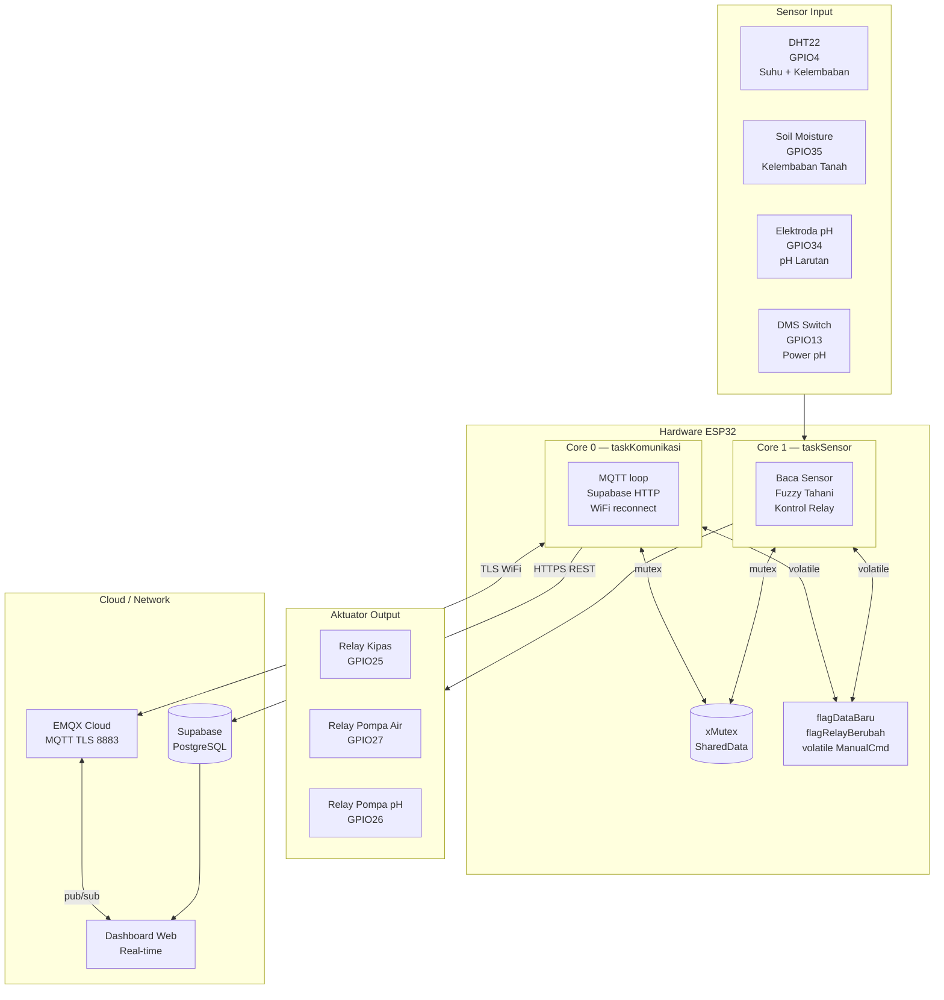
```mermaid
graph TB
    subgraph HW["Hardware ESP32"]
        subgraph C0["Core 0 — taskKomunikasi"]
            TK[MQTT loop\nSupabase HTTP\nWiFi reconnect]
        end
        subgraph C1["Core 1 — taskSensor"]
            TS[Baca Sensor\nFuzzy Tahani\nKontrol Relay]
        end
        MX[(xMutex\nSharedData)]
        FL[flagDataBaru\nflagRelayBerubah\nvolatile ManualCmd]
        C0 <-->|mutex| MX
        C1 <-->|mutex| MX
        C0 <-->|volatile| FL
        C1 <-->|volatile| FL
    end

    subgraph SENSOR["Sensor Input"]
        DHT[DHT22\nGPIO4\nSuhu + Kelembaban]
        SOIL[Soil Moisture\nGPIO35\nKelembaban Tanah]
        PH[Elektroda pH\nGPIO34\npH Larutan]
        DMS[DMS Switch\nGPIO13\nPower pH]
    end

    subgraph AKTUATOR["Aktuator Output"]
        KP[Relay Kipas\nGPIO25]
        PA[Relay Pompa Air\nGPIO27]
        PP[Relay Pompa pH\nGPIO26]
    end

    subgraph CLOUD["Cloud / Network"]
        MQTT[EMQX Cloud\nMQTT TLS 8883]
        SB[(Supabase\nPostgreSQL)]
        DB[Dashboard Web\nReal-time]
    end

    SENSOR --> C1
    C1 --> AKTUATOR
    C0 <-->|TLS WiFi| MQTT
    C0 -->|HTTPS REST| SB
    MQTT <-->|pub/sub| DB
    SB --> DB
```

---

## Diagram 2: Alur Inisialisasi (setup + boot kedua task)

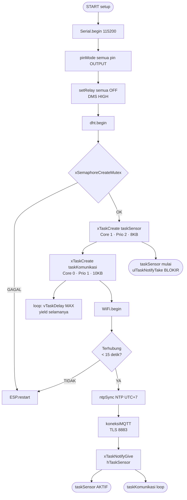
```mermaid
flowchart TD
    A([START setup]) --> B[Serial.begin 115200]
    B --> C[pinMode semua pin OUTPUT]
    C --> D[setRelay semua OFF\nDMS HIGH]
    D --> E[dht.begin]
    E --> F{xSemaphoreCreateMutex}
    F -->|GAGAL| G[ESP.restart]
    F -->|OK| H[xTaskCreate taskSensor\nCore 1 · Prio 2 · 8KB]
    H --> I[xTaskCreate taskKomunikasi\nCore 0 · Prio 1 · 10KB]
    I --> J[loop: vTaskDelay MAX\nyield selamanya]

    H --> K([taskSensor mulai\nulTaskNotifyTake BLOKIR])
    I --> L[WiFi.begin]
    L --> M{Terhubung\n< 15 detik?}
    M -->|TIDAK| G
    M -->|YA| N[ntpSync NTP UTC+7]
    N --> O[koneksiMQTT\nTLS 8883]
    O --> P[xTaskNotifyGive\nhTaskSensor]
    P --> K2([taskSensor AKTIF])
    P --> Q([taskKomunikasi loop])
```

---

## Diagram 3: Loop taskKomunikasi (Core 0)

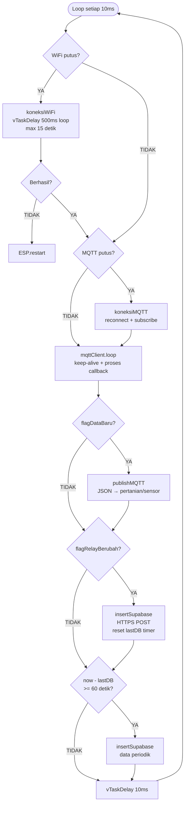
```mermaid
flowchart TD
    A([Loop setiap 10ms]) --> B{WiFi putus?}
    B -->|YA| C[koneksiWiFi\nvTaskDelay 500ms loop\nmax 15 detik]
    C --> D{Berhasil?}
    D -->|TIDAK| E[ESP.restart]
    D -->|YA| F
    B -->|TIDAK| F{MQTT putus?}
    F -->|YA| G[koneksiMQTT\nreconnect + subscribe]
    F -->|TIDAK| H
    G --> H[mqttClient.loop\nkeep-alive + proses callback]
    H --> I{flagDataBaru?}
    I -->|YA| J[publishMQTT\nJSON → pertanian/sensor]
    I -->|TIDAK| K
    J --> K{flagRelayBerubah?}
    K -->|YA| L[insertSupabase\nHTTPS POST\nreset lastDB timer]
    K -->|TIDAK| M
    L --> M{now - lastDB\n>= 60 detik?}
    M -->|YA| N[insertSupabase\ndata periodik]
    M -->|TIDAK| O[vTaskDelay 10ms]
    N --> O
    O --> A
```

---

## Diagram 4: Loop taskSensor (Core 1)

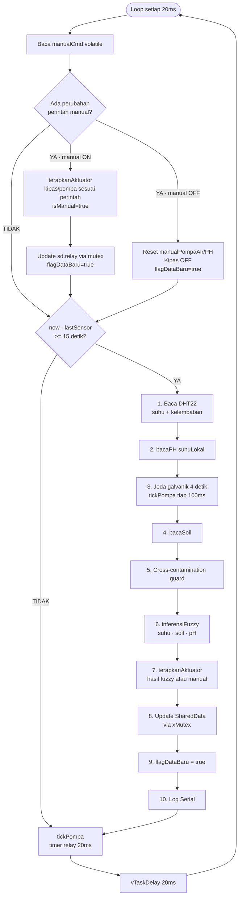
```mermaid
flowchart TD
    A([Loop setiap 20ms]) --> B[Baca manualCmd volatile]
    B --> C{Ada perubahan\nperintah manual?}
    C -->|YA - manual ON| D[terapkanAktuator\nkipas/pompa sesuai perintah\nisManual=true]
    D --> E[Update sd.relay via mutex\nflagDataBaru=true]
    C -->|YA - manual OFF| F[Reset manualPompaAir/PH\nKipas OFF\nflagDataBaru=true]
    C -->|TIDAK| G
    E --> G
    F --> G{now - lastSensor\n>= 15 detik?}
    G -->|YA| H[1. Baca DHT22\nsuhu + kelembaban]
    H --> I[2. bacaPH suhuLokal]
    I --> J[3. Jeda galvanik 4 detik\ntickPompa tiap 100ms]
    J --> K[4. bacaSoil]
    K --> L[5. Cross-contamination guard]
    L --> M[6. inferensiFuzzy\nsuhu · soil · pH]
    M --> N[7. terapkanAktuator\nhasil fuzzy atau manual]
    N --> O[8. Update SharedData\nvia xMutex]
    O --> P[9. flagDataBaru = true]
    P --> Q[10. Log Serial]
    G -->|TIDAK| R
    Q --> R[tickPompa\ntimer relay 20ms]
    R --> S[vTaskDelay 20ms]
    S --> A
```

---

## Diagram 5: Pipeline bacaPH

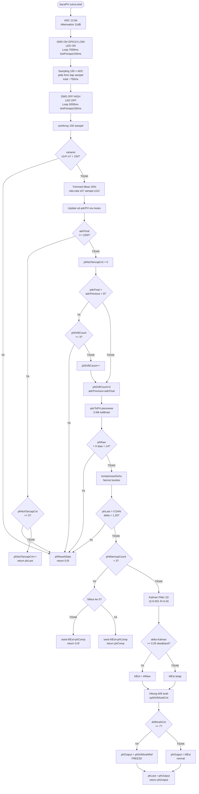
```mermaid
flowchart TD
    A([bacaPH suhuLokal]) --> B[ADC 12-bit\nAttenuation 11dB]
    B --> C[DMS ON GPIO13 LOW\nLED ON\nLoop 7000ms tickPompa/100ms]
    C --> D[Sampling 150 × ADC\njeda 5ms tiap sampel\ntotal ~750ms]
    D --> E[DMS OFF HIGH\nLED OFF\nLoop 2000ms tickPompa/100ms]
    E --> F[sortArray 150 sampel]
    F --> G{variansi\ns147-s7 > 150?}
    G -->|YA| H[phResetState\nreturn 0.0f]
    G -->|TIDAK| I[Trimmed Mean 25%\nrata-rata s37 sampai s112]
    I --> J[Update sd.adcPH via mutex]
    J --> K{adcFinal\n>= 1250?}
    K -->|YA| L{phNotTancapCnt\n>= 5?}
    L -->|YA| H
    L -->|TIDAK| M[phNotTancapCnt++\nreturn phLast]
    K -->|TIDAK| N[phNotTancapCnt = 0]
    N --> O{adcFinal >\nadcPrevious + 8?}
    O -->|YA| P{phDriftCount\n>= 3?}
    P -->|YA| H
    P -->|TIDAK| Q[phDriftCount++]
    Q --> R
    O -->|TIDAK| R[phDriftCount=0\nadcPrevious=adcFinal]
    R --> S[adcToPH piecewise\n3 titik kalibrasi]
    S --> T{phRaw\n< 0 atau > 14?}
    T -->|YA| H
    T -->|TIDAK| U[kompensasiSuhu\nNernst koreksi]
    U --> V{phLast > 0 DAN\ndelta > 1.20?}
    V -->|YA| H
    V -->|TIDAK| W{phWarmupCount\n< 3?}
    W -->|YA| X{Siklus ke-3?}
    X -->|TIDAK| Y[seed kfEst=phComp\nreturn 0.0f]
    X -->|YA| Z[seed kfEst=phComp\nreturn phComp]
    W -->|TIDAK| AA[Kalman Filter 1D\nQ=0.001 R=0.40]
    AA --> AB{delta Kalman\n>= 0.05 deadband?}
    AB -->|YA| AC[kfEst = kfNew]
    AB -->|TIDAK| AD[kfEst tetap]
    AC --> AE[Hitung drift arah\n±phDriftArahCnt]
    AD --> AE
    AE --> AF{driftArahCnt\n>= 7?}
    AF -->|YA| AG[phOutput = phDriftArahRef\nFREEZE]
    AF -->|TIDAK| AH[phOutput = kfEst\nnormal]
    AG --> AI[phLast = phOutput\nreturn phOutput]
    AH --> AI
```

---

## Diagram 6: Pipeline bacaSoil

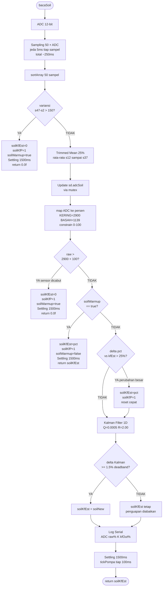
```mermaid
flowchart TD
    A([bacaSoil]) --> B[ADC 12-bit]
    B --> C[Sampling 50 × ADC\njeda 5ms tiap sampel\ntotal ~250ms]
    C --> D[sortArray 50 sampel]
    D --> E{variansi\ns47-s2 > 150?}
    E -->|YA| F[soilKfEst=0\nsoilKfP=1\nsoilWarmup=true\nSettling 1500ms\nreturn 0.0f]
    E -->|TIDAK| G[Trimmed Mean 25%\nrata-rata s12 sampai s37]
    G --> H[Update sd.adcSoil\nvia mutex]
    H --> I[map ADC ke persen\nKERING=2900 BASAH=1139\nconstrain 0-100]
    I --> J{raw >\n2900 + 100?}
    J -->|YA sensor dicabut| K[soilKfEst=0\nsoilKfP=1\nsoilWarmup=true\nSettling 1500ms\nreturn 0.0f]
    J -->|TIDAK| L{soilWarmup\n== true?}
    L -->|YA| M[soilKfEst=pct\nsoilKfP=1\nsoilWarmup=false\nSettling 1500ms\nreturn soilKfEst]
    L -->|TIDAK| N{delta pct\nvs kfEst > 25%?}
    N -->|YA perubahan besar| O[soilKfEst=pct\nsoilKfP=1\nreset cepat]
    N -->|TIDAK| P
    O --> P[Kalman Filter 1D\nQ=0.0005 R=2.00]
    P --> Q{delta Kalman\n>= 1.5% deadband?}
    Q -->|YA| R[soilKfEst = soilNew]
    Q -->|TIDAK| S[soilKfEst tetap\npenguapan diabaikan]
    R --> T[Log Serial\nADC raw% K kfOut%]
    S --> T
    T --> U[Settling 1500ms\ntickPompa tiap 100ms]
    U --> V([return soilKfEst])
```

---

## Diagram 7: Inferensi Fuzzy Tahani

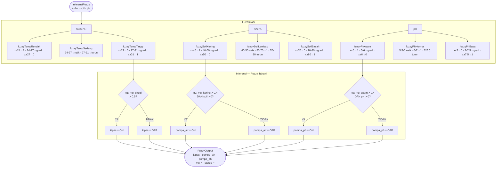
```mermaid
flowchart TD
    A([inferensiFuzzy\nsuhu · soil · pH]) --> B

    subgraph FUZZ["Fuzzifikasi"]
        B[Suhu °C] --> B1[fuzzyTempRendah\nx≤24→1 · 24-27→grad · x≥27→0]
        B --> B2[fuzzyTempSedang\n24-27→naik · 27-31→turun]
        B --> B3[fuzzyTempTinggi\nx≤27→0 · 27-31→grad · x≥31→1]

        C[Soil %] --> C1[fuzzySoilKering\nx≤40→1 · 40-50→grad · x≥50→0]
        C --> C2[fuzzySoilLembab\n40-50 naik · 50-70→1 · 70-80 turun]
        C --> C3[fuzzySoilBasah\nx≤70→0 · 70-80→grad · x≥80→1]

        D[pH] --> D1[fuzzyPhAsam\nx≤5→1 · 5-6→grad · x≥6→0]
        D --> D2[fuzzyPhNormal\n5.5-6 naik · 6-7→1 · 7-7.5 turun]
        D --> D3[fuzzyPhBasa\nx≤7→0 · 7-7.5→grad · x≥7.5→1]
    end

    subgraph INF["Inferensi — Fuzzy Tahani"]
        B3 --> R1{R1: mu_tinggi\n> 0.5?}
        R1 -->|YA| KI[kipas = ON]
        R1 -->|TIDAK| KO[kipas = OFF]

        C1 --> R2{R2: mu_kering > 0.4\nDAN soil > 0?}
        R2 -->|YA| AI[pompa_air = ON]
        R2 -->|TIDAK| AO[pompa_air = OFF]

        D1 --> R3{R3: mu_asam > 0.4\nDAN pH > 0?}
        R3 -->|YA| PI[pompa_ph = ON]
        R3 -->|TIDAK| PO[pompa_ph = OFF]
    end

    KI --> OUT([FuzzyOutput\nkipas · pompa_air · pompa_ph\nmu_* · status_*])
    KO --> OUT
    AI --> OUT
    AO --> OUT
    PI --> OUT
    PO --> OUT
```

---

## Diagram 8: tickPompa — Logika Relay Pompa

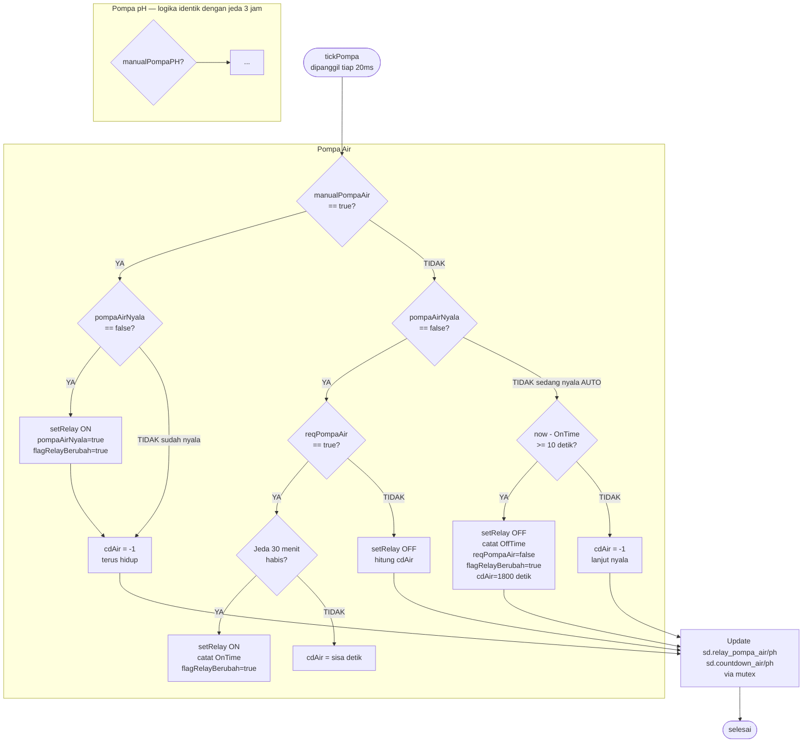
```mermaid
flowchart TD
    A([tickPompa\ndipanggil tiap 20ms]) --> B

    subgraph AIR["Pompa Air"]
        B{manualPompaAir\n== true?}
        B -->|YA| C{pompaAirNyala\n== false?}
        C -->|YA| D[setRelay ON\npompaAirNyala=true\nflagRelayBerubah=true]
        C -->|TIDAK sudah nyala| E[cdAir = -1\nterus hidup]
        D --> E

        B -->|TIDAK| F{pompaAirNyala\n== false?}
        F -->|YA| G{reqPompaAir\n== true?}
        G -->|YA| H{Jeda 30 menit\nhabis?}
        H -->|YA| I[setRelay ON\ncatat OnTime\nflagRelayBerubah=true]
        H -->|TIDAK| J[cdAir = sisa detik]
        G -->|TIDAK| K[setRelay OFF\nhitung cdAir]

        F -->|TIDAK sedang nyala AUTO| L{now - OnTime\n>= 10 detik?}
        L -->|YA| M[setRelay OFF\ncatat OffTime\nreqPompaAir=false\nflagRelayBerubah=true\ncdAir=1800 detik]
        L -->|TIDAK| N[cdAir = -1\nlanjut nyala]
    end

    subgraph PH["Pompa pH — logika identik dengan jeda 3 jam"]
        O{manualPompaPH?} --> P[...]
    end

    M --> Q[Update sd.relay_pompa_air/ph\nsd.countdown_air/ph\nvia mutex]
    N --> Q
    E --> Q
    K --> Q
    Q --> R([selesai])
```

---

## Diagram 9: Alur Mode Manual vs Auto

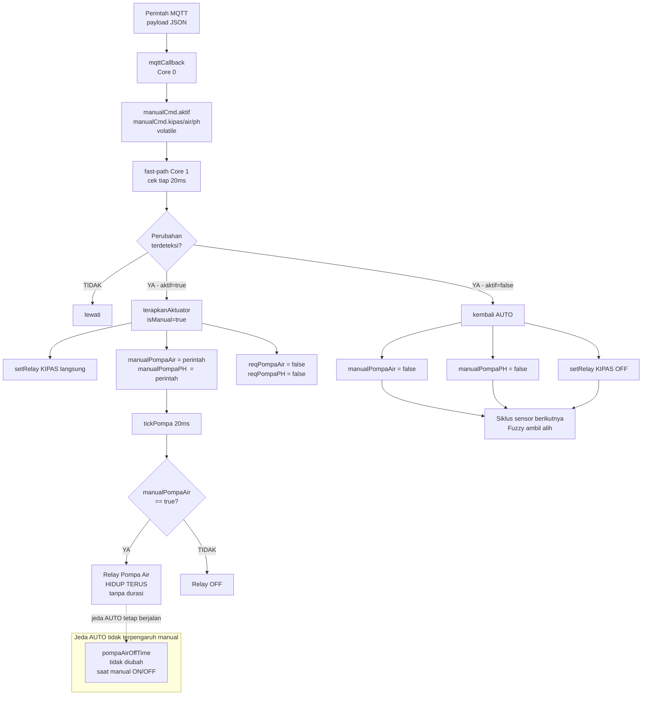
```mermaid
flowchart TD
    A[Perintah MQTT\npayload JSON] --> B[mqttCallback\nCore 0]
    B --> C[manualCmd.aktif\nmanualCmd.kipas/air/ph\nvolatile]

    C --> D[fast-path Core 1\ncek tiap 20ms]
    D --> E{Perubahan\nterdeteksi?}

    E -->|TIDAK| F[lewati]
    E -->|YA - aktif=true| G[terapkanAktuator\nisManual=true]

    G --> G1[setRelay KIPAS langsung]
    G --> G2[manualPompaAir = perintah\nmanualPompaPH  = perintah]
    G --> G3[reqPompaAir = false\nreqPompaPH  = false]

    G2 --> H[tickPompa 20ms]
    H --> I{manualPompaAir\n== true?}
    I -->|YA| J[Relay Pompa Air\nHIDUP TERUS\ntanpa durasi]
    I -->|TIDAK| K[Relay OFF]

    E -->|YA - aktif=false| L[kembali AUTO]
    L --> L1[manualPompaAir = false]
    L --> L2[manualPompaPH  = false]
    L --> L3[setRelay KIPAS OFF]
    L1 & L2 & L3 --> M[Siklus sensor berikutnya\nFuzzy ambil alih]

    subgraph JEDA["Jeda AUTO tidak terpengaruh manual"]
        N[pompaAirOffTime\ntidak diubah\nsaat manual ON/OFF]
    end

    J -.->|jeda AUTO tetap berjalan| N
```

---

## Diagram 10: Sinkronisasi Dual Core

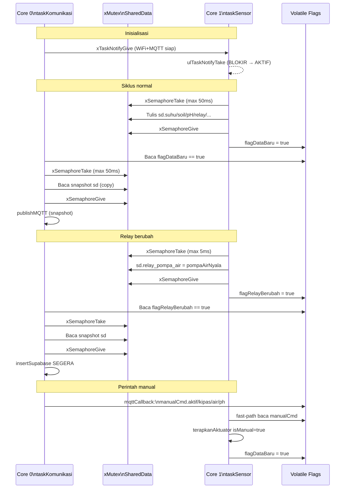
```mermaid
sequenceDiagram
    participant C0 as Core 0\ntaskKomunikasi
    participant MX as xMutex\nSharedData
    participant C1 as Core 1\ntaskSensor
    participant FL as Volatile Flags

    Note over C0,C1: Inisialisasi
    C0->>C1: xTaskNotifyGive (WiFi+MQTT siap)
    C1-->>C1: ulTaskNotifyTake (BLOKIR → AKTIF)

    Note over C0,C1: Siklus normal
    C1->>MX: xSemaphoreTake (max 50ms)
    C1->>MX: Tulis sd.suhu/soil/pH/relay/...
    C1->>MX: xSemaphoreGive
    C1->>FL: flagDataBaru = true

    C0->>FL: Baca flagDataBaru == true
    C0->>MX: xSemaphoreTake (max 50ms)
    C0->>MX: Baca snapshot sd (copy)
    C0->>MX: xSemaphoreGive
    C0->>C0: publishMQTT (snapshot)

    Note over C0,C1: Relay berubah
    C1->>MX: xSemaphoreTake (max 5ms)
    C1->>MX: sd.relay_pompa_air = pompaAirNyala
    C1->>MX: xSemaphoreGive
    C1->>FL: flagRelayBerubah = true

    C0->>FL: Baca flagRelayBerubah == true
    C0->>MX: xSemaphoreTake
    C0->>MX: Baca snapshot sd
    C0->>MX: xSemaphoreGive
    C0->>C0: insertSupabase SEGERA

    Note over C0,C1: Perintah manual
    C0->>FL: mqttCallback:\nmanualCmd.aktif/kipas/air/ph
    C1->>FL: fast-path baca manualCmd
    C1->>C1: terapkanAktuator isManual=true
    C1->>FL: flagDataBaru = true
```

---

## Diagram 11: Timeline Satu Siklus Sensor

```mermaid
gantt
    title Satu Siklus Sensor (±16 detik)
    dateFormat  s
    axisFormat  %Ss

    section Core 1
    DHT22 readTemp+Hum        :a1, 0, 0.25s
    bacaPH - DMS ON 7 detik   :a2, 0.25, 7.25s
    bacaPH - Sampling 150pkt  :a3, 7.25, 8.00s
    bacaPH - DMS OFF 2 detik  :a4, 8.00, 10.00s
    bacaPH - Filter Kalman    :a5, 10.00, 10.10s
    Jeda galvanik 4 detik     :a6, 10.10, 14.10s
    bacaSoil - Sampling 50pkt :a7, 14.10, 14.36s
    bacaSoil - Kalman+Settling:a8, 14.36, 15.86s
    Cross-guard + Fuzzy       :a9, 15.86, 15.90s
    Update SharedData         :a10, 15.90, 15.92s

    section Core 0 (paralel)
    MQTT loop tiap 10ms       :b1, 0, 15.92s
    tickPompa tiap 100ms      :b2, 0, 15.92s
    publishMQTT setelah data  :b3, 15.92, 16.00s
```

---

## Diagram 12: Fungsi Keanggotaan Fuzzy — Suhu

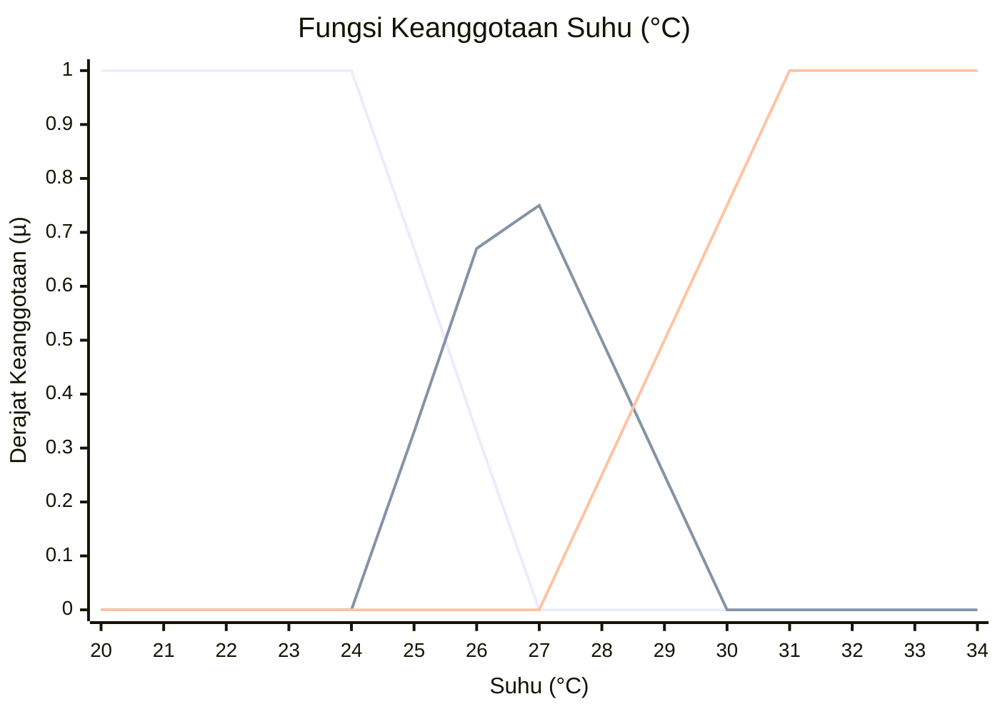
```mermaid
xychart-beta
    title "Fungsi Keanggotaan Suhu (°C)"
    x-axis "Suhu (°C)" [20, 21, 22, 23, 24, 25, 26, 27, 28, 29, 30, 31, 32, 33, 34]
    y-axis "Derajat Keanggotaan (µ)" 0 --> 1
    line "Rendah"  [1, 1, 1, 1, 1, 0.67, 0.33, 0, 0, 0, 0, 0, 0, 0, 0]
    line "Sedang"  [0, 0, 0, 0, 0, 0.33, 0.67, 0.75, 0.50, 0.25, 0, 0, 0, 0, 0]
    line "Tinggi"  [0, 0, 0, 0, 0, 0, 0, 0, 0.25, 0.50, 0.75, 1, 1, 1, 1]
```

---

## Diagram 13: Fungsi Keanggotaan Fuzzy — Soil Moisture

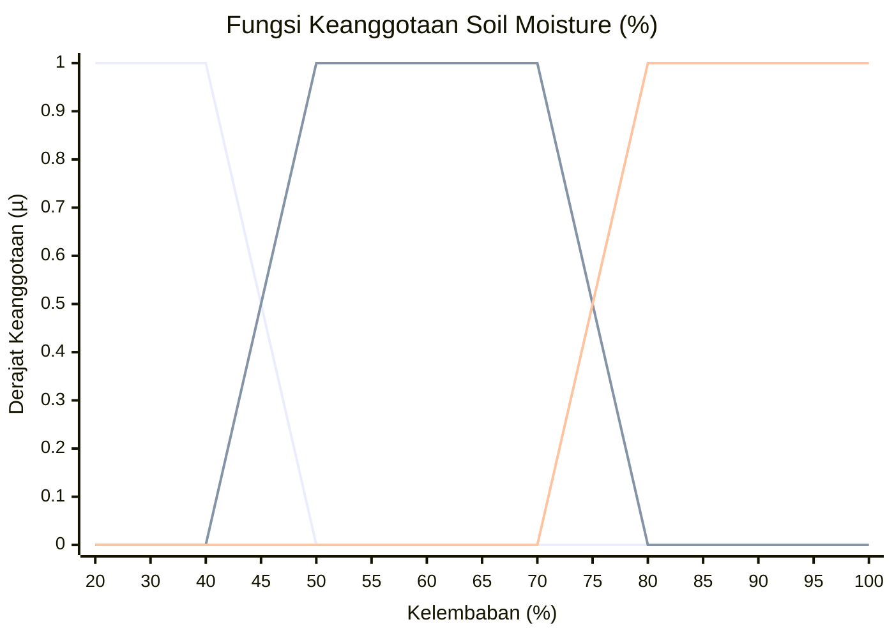
```mermaid
xychart-beta
    title "Fungsi Keanggotaan Soil Moisture (%)"
    x-axis "Kelembaban (%)" [20, 30, 40, 45, 50, 55, 60, 65, 70, 75, 80, 85, 90, 95, 100]
    y-axis "Derajat Keanggotaan (µ)" 0 --> 1
    line "Kering" [1, 1, 1, 0.5, 0, 0, 0, 0, 0, 0, 0, 0, 0, 0, 0]
    line "Lembab" [0, 0, 0, 0.5, 1, 1, 1, 1, 1, 0.5, 0, 0, 0, 0, 0]
    line "Basah"  [0, 0, 0, 0, 0, 0, 0, 0, 0, 0.5, 1, 1, 1, 1, 1]
```

---

## Diagram 14: Fungsi Keanggotaan Fuzzy — pH

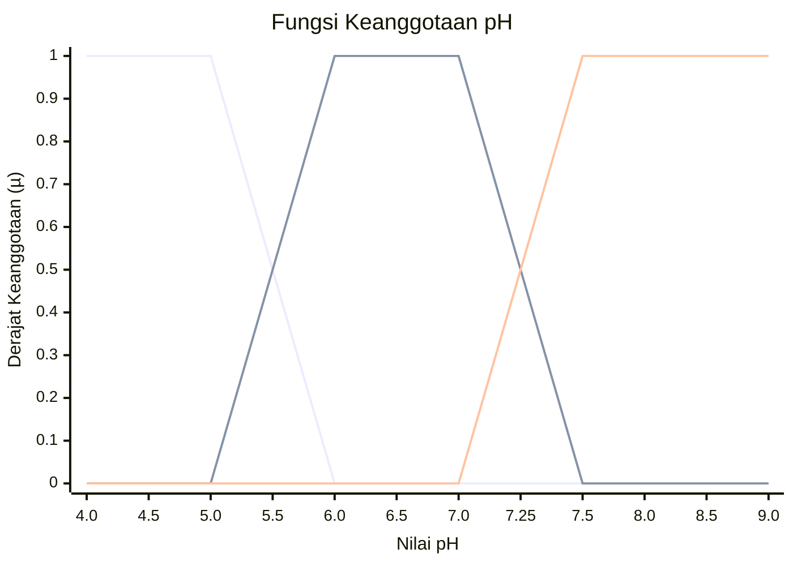
```mermaid
xychart-beta
    title "Fungsi Keanggotaan pH"
    x-axis "Nilai pH" [4.0, 4.5, 5.0, 5.5, 6.0, 6.5, 7.0, 7.25, 7.5, 8.0, 8.5, 9.0]
    y-axis "Derajat Keanggotaan (µ)" 0 --> 1
    line "Asam"   [1, 1, 1, 0.5, 0, 0, 0, 0, 0, 0, 0, 0]
    line "Normal" [0, 0, 0, 0.5, 1, 1, 1, 0.5, 0, 0, 0, 0]
    line "Basa"   [0, 0, 0, 0, 0, 0, 0, 0.5, 1, 1, 1, 1]
```

---

## Diagram 15: Alur Pengiriman Data ke Cloud

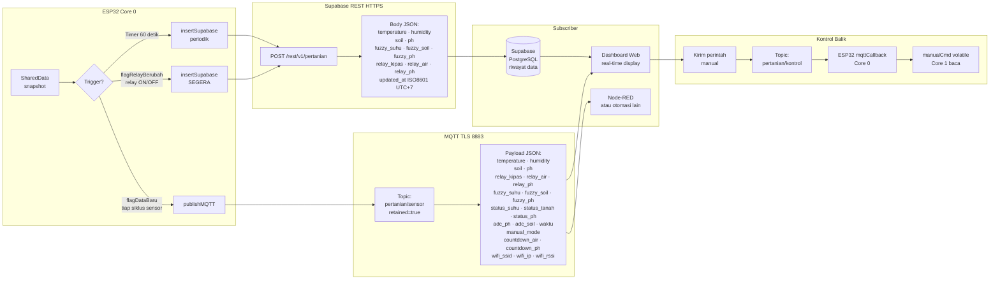
```mermaid
flowchart LR
    subgraph ESP["ESP32 Core 0"]
        A[SharedData\nsnapshot] --> B{Trigger?}
        B -->|flagDataBaru\ntiap siklus sensor| C[publishMQTT]
        B -->|flagRelayBerubah\nrelay ON/OFF| D[insertSupabase\nSEGERA]
        B -->|Timer 60 detik| E[insertSupabase\nperiodik]
    end

    subgraph MQTT_FLOW["MQTT TLS 8883"]
        C --> F[Topic:\npertanian/sensor\nretained=true]
        F --> G[Payload JSON:\ntemperature · humidity\nsoil · ph\nrelay_kipas · relay_air · relay_ph\nfuzzy_suhu · fuzzy_soil · fuzzy_ph\nstatus_suhu · status_tanah · status_ph\nadc_ph · adc_soil · waktu\nmanual_mode\ncountdown_air · countdown_ph\nwifi_ssid · wifi_ip · wifi_rssi]
    end

    subgraph SB_FLOW["Supabase REST HTTPS"]
        D --> H[POST /rest/v1/pertanian]
        E --> H
        H --> I[Body JSON:\ntemperature · humidity\nsoil · ph\nfuzzy_suhu · fuzzy_soil · fuzzy_ph\nrelay_kipas · relay_air · relay_ph\nupdated_at ISO8601 UTC+7]
    end

    subgraph SUB["Subscriber"]
        G --> J[Dashboard Web\nreal-time display]
        G --> K[Node-RED\natau otomasi lain]
        I --> L[(Supabase\nPostgreSQL\nriwayat data)]
        L --> J
    end

    subgraph CTRL["Kontrol Balik"]
        J --> M[Kirim perintah\nmanual]
        M --> N[Topic:\npertanian/kontrol]
        N --> O[ESP32 mqttCallback\nCore 0]
        O --> P[manualCmd volatile\nCore 1 baca]
    end
```

---

## Diagram 16: State Machine Pompa (Auto + Manual)

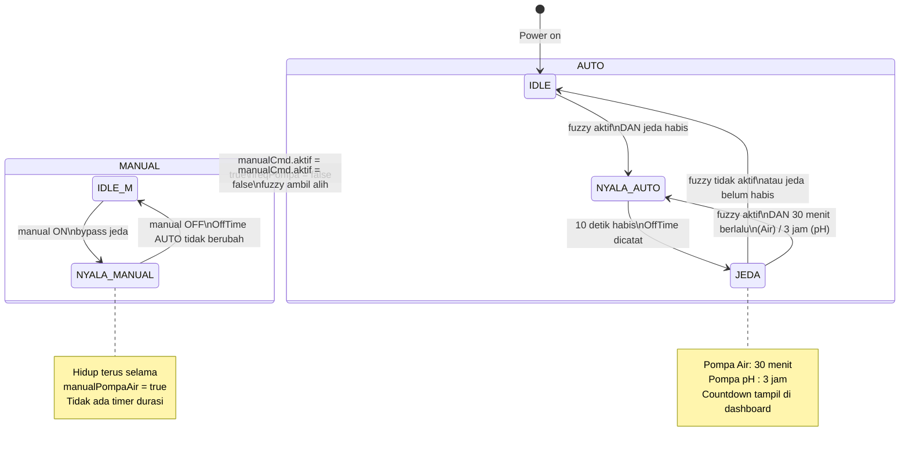
```mermaid
stateDiagram-v2
    [*] --> IDLE : Power on

    state "AUTO" as AUTO {
        IDLE --> NYALA_AUTO : fuzzy aktif\nDAN jeda habis
        NYALA_AUTO --> JEDA : 10 detik habis\nOffTime dicatat
        JEDA --> IDLE : fuzzy tidak aktif\natau jeda belum habis
        JEDA --> NYALA_AUTO : fuzzy aktif\nDAN 30 menit berlalu\n(Air) / 3 jam (pH)
    }

    state "MANUAL" as MANUAL {
        IDLE_M --> NYALA_MANUAL : manual ON\nbypass jeda
        NYALA_MANUAL --> IDLE_M : manual OFF\nOffTime AUTO tidak berubah
    }

    AUTO --> MANUAL : manualCmd.aktif = true\nreqPompa = false
    MANUAL --> AUTO : manualCmd.aktif = false\nfuzzy ambil alih

    note right of NYALA_MANUAL
        Hidup terus selama
        manualPompaAir = true
        Tidak ada timer durasi
    end note

    note right of JEDA
        Pompa Air: 30 menit
        Pompa pH : 3 jam
        Countdown tampil di dashboard
    end note
```

---

## Diagram 17: State Machine Filter pH

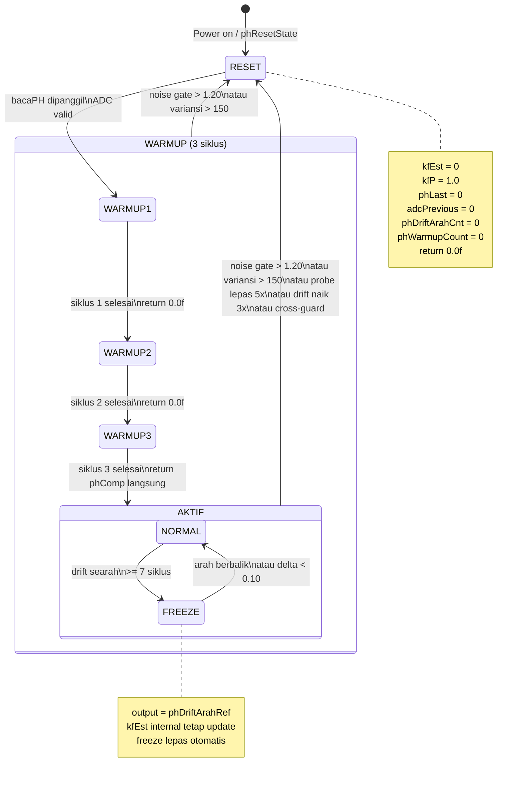
```mermaid
stateDiagram-v2
    [*] --> RESET : Power on / phResetState

    RESET --> WARMUP1 : bacaPH dipanggil\nADC valid

    state "WARMUP (3 siklus)" as WU {
        WARMUP1 --> WARMUP2 : siklus 1 selesai\nreturn 0.0f
        WARMUP2 --> WARMUP3 : siklus 2 selesai\nreturn 0.0f
        WARMUP3 --> AKTIF : siklus 3 selesai\nreturn phComp langsung
    }

    state "AKTIF" as AKTIF {
        NORMAL --> FREEZE : drift searah\n>= 7 siklus
        FREEZE --> NORMAL : arah berbalik\natau delta < 0.10
    }

    AKTIF --> RESET : noise gate > 1.20\natau variansi > 150\natau probe lepas 5x\natau drift naik 3x\natau cross-guard
    WU --> RESET : noise gate > 1.20\natau variansi > 150

    note right of RESET
        kfEst = 0
        kfP = 1.0
        phLast = 0
        adcPrevious = 0
        phDriftArahCnt = 0
        phWarmupCount = 0
        return 0.0f
    end note

    note right of FREEZE
        output = phDriftArahRef
        kfEst internal tetap update
        freeze lepas otomatis
    end note
```

---

## Diagram 18: State Machine Filter Soil

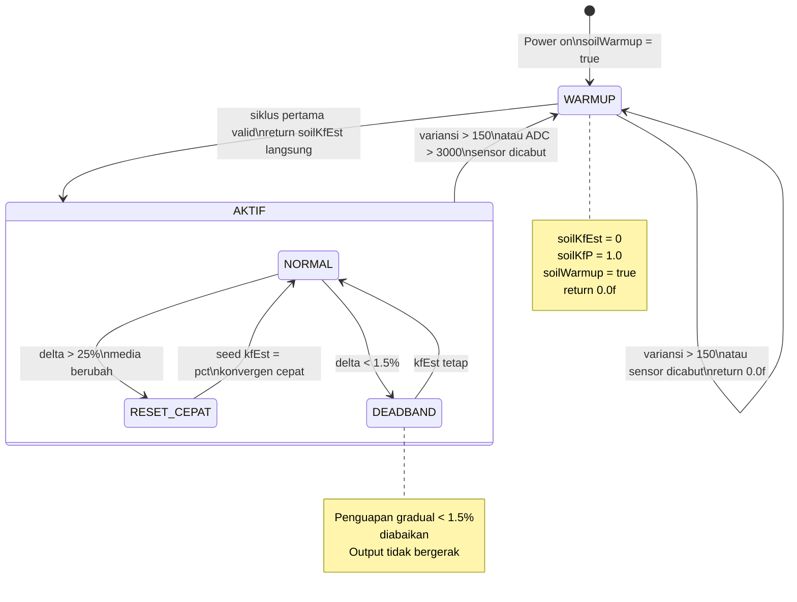
```mermaid
stateDiagram-v2
    [*] --> WARMUP : Power on\nsoilWarmup = true

    WARMUP --> AKTIF : siklus pertama valid\nreturn soilKfEst langsung

    WARMUP --> WARMUP : variansi > 150\natau sensor dicabut\nreturn 0.0f

    state "AKTIF" as AKTIF {
        NORMAL --> RESET_CEPAT : delta > 25%\nmedia berubah
        RESET_CEPAT --> NORMAL : seed kfEst = pct\nkonvergen cepat
        NORMAL --> DEADBAND : delta < 1.5%
        DEADBAND --> NORMAL : kfEst tetap
    }

    AKTIF --> WARMUP : variansi > 150\natau ADC > 3000\nsensor dicabut

    note right of WARMUP
        soilKfEst = 0
        soilKfP = 1.0
        soilWarmup = true
        return 0.0f
    end note

    note right of DEADBAND
        Penguapan gradual < 1.5%
        diabaikan
        Output tidak bergerak
    end note
```

---

## Diagram 19: Isolasi Interferensi Galvanik

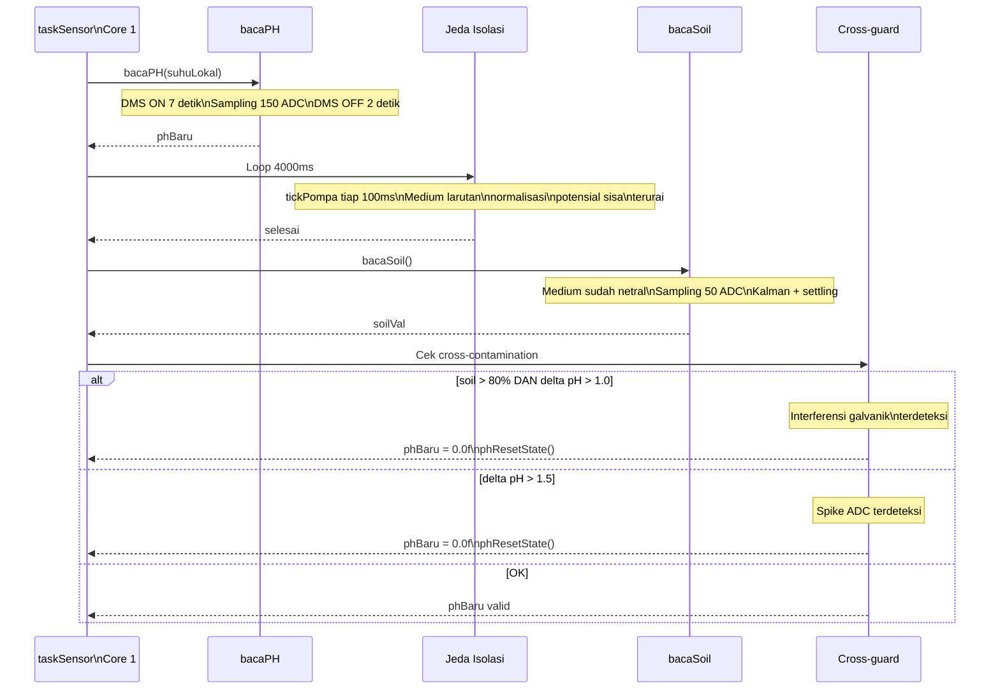
```mermaid
sequenceDiagram
    participant TS as taskSensor\nCore 1
    participant PH as bacaPH
    participant ISO as Jeda Isolasi
    participant SOIL as bacaSoil
    participant GRD as Cross-guard

    TS->>PH: bacaPH(suhuLokal)
    Note over PH: DMS ON 7 detik\nSampling 150 ADC\nDMS OFF 2 detik
    PH-->>TS: phBaru

    TS->>ISO: Loop 4000ms
    Note over ISO: tickPompa tiap 100ms\nMedium larutan\nnormalisasi\npotensial sisa\nterurai
    ISO-->>TS: selesai

    TS->>SOIL: bacaSoil()
    Note over SOIL: Medium sudah netral\nSampling 50 ADC\nKalman + settling
    SOIL-->>TS: soilVal

    TS->>GRD: Cek cross-contamination
    alt soil > 80% DAN delta pH > 1.0
        Note over GRD: Interferensi galvanik\nterdeteksi
        GRD-->>TS: phBaru = 0.0f\nphResetState()
    else delta pH > 1.5
        Note over GRD: Spike ADC terdeteksi
        GRD-->>TS: phBaru = 0.0f\nphResetState()
    else OK
        GRD-->>TS: phBaru valid
    end
```

---

## Diagram 20: Ringkasan Waktu Respons Sistem

```mermaid
gantt
    title Waktu Respons dari Berbagai Trigger
    dateFormat  X
    axisFormat  %Lms

    section Perintah Manual
    MQTT masuk ke Serial log          :a1, 0, 50
    MQTT ke kipas nyala               :a2, 0, 50
    MQTT ke pompa nyala               :a3, 0, 100

    section Data ke Cloud
    Relay berubah ke Supabase         :b1, 0, 200
    Sensor baru ke MQTT publish       :b2, 0, 50
    Sensor baru ke Supabase periodik  :b3, 0, 60000

    section Stabilisasi Sensor
    Output Soil pertama               :c1, 0, 17000
    Output pH pertama warmup          :c2, 0, 50000
    Kalman pH stabil penuh            :c3, 0, 180000
```

---

## Diagram 21: Peta Pin dan Koneksi Hardware

```mermaid
graph LR
    subgraph ESP32["ESP32 Dev Module"]
        G4[GPIO 4]
        G13[GPIO 13]
        G2[GPIO 2]
        G25[GPIO 25]
        G26[GPIO 26]
        G27[GPIO 27]
        G34[GPIO 34\nADC input-only]
        G35[GPIO 35\nADC input-only]
    end

    subgraph SENSOR["Sensor"]
        DHT[DHT22\nSuhu + RH]
        DMS[DMS Switch\nPower pH]
        LED[LED Built-in\nIndikator pH]
        PH_ADC[Modul pH\nOutput 0-3.3V]
        SOIL_ADC[Sensor Soil\nResistif]
    end

    subgraph RELAY["Modul Relay 3CH\nAktif LOW"]
        RK[CH1 Kipas]
        RA[CH2 Pompa Air]
        RP[CH3 Pompa pH]
    end

    subgraph AKTUATOR["Aktuator"]
        FAN[Kipas\nPendingin]
        PUMP_W[Pompa\nAir]
        PUMP_P[Pompa\npH]
    end

    G4  --- DHT
    G13 --- DMS
    G2  --- LED
    G34 --- PH_ADC
    G35 --- SOIL_ADC
    G25 --- RK --- FAN
    G26 --- RP --- PUMP_P
    G27 --- RA --- PUMP_W

    DMS -.->|kontrol daya| PH_ADC
```

---

## Indeks Diagram

| No | Judul | Jenis |
|----|-------|-------|
| 1 | Arsitektur Sistem Keseluruhan | graph TB |
| 2 | Alur Inisialisasi setup + boot | flowchart |
| 3 | Loop taskKomunikasi Core 0 | flowchart |
| 4 | Loop taskSensor Core 1 | flowchart |
| 5 | Pipeline bacaPH lengkap | flowchart |
| 6 | Pipeline bacaSoil lengkap | flowchart |
| 7 | Inferensi Fuzzy Tahani | flowchart |
| 8 | tickPompa logika relay | flowchart |
| 9 | Alur Mode Manual vs Auto | flowchart |
| 10 | Sinkronisasi Dual Core | sequence |
| 11 | Timeline satu siklus sensor | gantt |
| 12 | Fungsi keanggotaan Suhu | xychart |
| 13 | Fungsi keanggotaan Soil | xychart |
| 14 | Fungsi keanggotaan pH | xychart |
| 15 | Alur pengiriman data ke Cloud | flowchart |
| 16 | State machine Pompa | stateDiagram |
| 17 | State machine Filter pH | stateDiagram |
| 18 | State machine Filter Soil | stateDiagram |
| 19 | Isolasi interferensi galvanik | sequence |
| 20 | Ringkasan waktu respons | gantt |
| 21 | Peta pin dan koneksi hardware | graph |

---

*Semua diagram menggunakan sintaks Mermaid dan dapat dirender di
GitHub, GitLab, Obsidian, VS Code Extension, atau mermaid.live*
