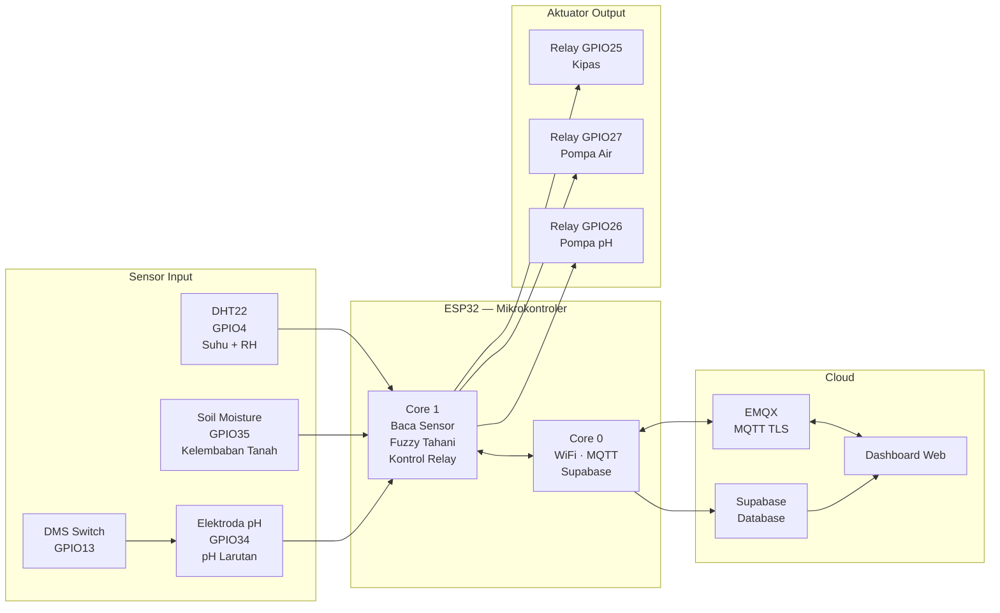

# Komponen Sistem — IoT Pertanian Cerdas Cabai Rawit

---

## A. Mikrokontroler

| No | Komponen | Spesifikasi | Fungsi dalam Sistem |
|----|----------|-------------|---------------------|
| 1 | **ESP32 Dev Module (ESP32-30P)** | Dual Core 240MHz, RAM 520KB, Flash 4MB, WiFi 802.11 b/g/n, Bluetooth | Otak utama sistem. Core 0 menangani komunikasi WiFi/MQTT/Supabase, Core 1 menangani pembacaan sensor dan kontrol aktuator secara paralel menggunakan FreeRTOS |

---

## B. Sensor

| No | Komponen | Pin ESP32 | Spesifikasi | Fungsi dalam Sistem |
|----|----------|-----------|-------------|---------------------|
| 2 | **DHT22** | GPIO 4 | Suhu -40–80°C (±0.5°C), Kelembaban 0–100% RH (±2–5%) | Mengukur suhu dan kelembaban udara. Jika suhu > 28.5°C maka kipas dinyalakan secara otomatis |
| 3 | **Sensor Soil Moisture Resistif** | GPIO 35 (ADC input-only) | ADC 12-bit (0–4095), tegangan 3.3V | Mengukur kelembaban tanah. Prinsip kerja: ADC besar = kering, ADC kecil = basah. Jika kelembaban < 46% maka pompa air dinyalakan |
| 4 | **Elektroda pH Analog** | GPIO 34 (ADC input-only) | Output 0–3.3V, ADC 12-bit, rentang pH 0–14 | Mengukur pH larutan. Jika pH < 5.6 (asam) maka pompa pH dinyalakan untuk menambah larutan penyeimbang |
| 5 | **Modul DMS (Digital Module Switch)** | GPIO 13 (output) | Saklar daya digital aktif LOW | Mengaktifkan/menonaktifkan daya ke modul sensor pH. Dimatikan saat tidak dipakai untuk memperpanjang umur elektroda |
| 6 | **LED Built-in** | GPIO 2 (output) | LED onboard ESP32 | Indikator visual bahwa proses pembacaan pH sedang berlangsung |

---

## C. Aktuator

| No | Komponen | Pin ESP32 | Spesifikasi | Fungsi dalam Sistem |
|----|----------|-----------|-------------|---------------------|
| 7 | **Modul Relay 3 Channel** | GPIO 25, 27, 26 | Aktif LOW, 5V coil, kontak 10A/250VAC | Saklar elektronik untuk menghidupkan/mematikan beban. Aktif LOW artinya GPIO LOW = relay ON, GPIO HIGH = relay OFF |
| 8 | **Kipas Pendingin** | Relay CH1 (GPIO 25) | AC/DC sesuai kebutuhan | Menurunkan suhu lingkungan saat suhu > 28.5°C. Nyala dan mati langsung tanpa timer |
| 9 | **Pompa Air** | Relay CH2 (GPIO 27) | Mini submersible pump | Menyirami tanaman saat kelembaban tanah < 46%. Nyala 10 detik, jeda 30 menit |
| 10 | **Pompa pH** | Relay CH3 (GPIO 26) | Mini dosing pump | Menambahkan larutan penyeimbang pH saat pH < 5.6 (asam). Nyala 10 detik, jeda 3 jam |

---

## D. Koneksi dan Komunikasi

| No | Komponen | Protokol | Spesifikasi | Fungsi dalam Sistem |
|----|----------|----------|-------------|---------------------|
| 11 | **WiFi ESP32** | 802.11 b/g/n | 2.4GHz, WPA2 | Menghubungkan ESP32 ke jaringan internet untuk komunikasi cloud |
| 12 | **EMQX Cloud Broker** | MQTT TLS 8883 | Broker cloud, QoS 0, retained message | Menerima dan mendistribusikan data sensor dari ESP32 ke dashboard web secara real-time |
| 13 | **Supabase** | HTTPS REST API | PostgreSQL cloud, POST /rest/v1/pertanian | Menyimpan riwayat data sensor dan status aktuator ke database. Data dikirim tiap 60 detik atau segera saat relay berubah state |

---

## E. Software dan Logika

| No | Komponen Software | Keterangan |
|----|-------------------|------------|
| 14 | **FreeRTOS** | Sistem operasi real-time bawaan ESP32. Menjalankan 2 task paralel di 2 core berbeda |
| 15 | **Fuzzy Tahani** | Metode pengambilan keputusan. Input: suhu, kelembaban tanah, pH. Output: keputusan nyala/mati tiap aktuator |
| 16 | **Kalman Filter 1D** | Filter estimasi nilai sensor. Menyaring noise ADC pada sensor pH dan soil moisture agar pembacaan lebih stabil |
| 17 | **PubSubClient** | Library Arduino untuk protokol MQTT. Menangani koneksi, publish, dan subscribe topic |
| 18 | **ArduinoJson** | Library untuk membuat dan membaca format JSON pada payload MQTT dan Supabase |

---

## F. Ringkasan Pin ESP32

```
ESP32 Dev Module (ESP32-30P)
├── GPIO  4  → DHT22 (Data)
├── GPIO  2  → LED Built-in (Indikator pH)
├── GPIO 13  → DMS Switch (Power sensor pH)
├── GPIO 34  → ADC pH Elektroda    [input-only]
├── GPIO 35  → ADC Soil Moisture   [input-only]
├── GPIO 25  → Relay Kipas         [aktif LOW]
├── GPIO 26  → Relay Pompa pH      [aktif LOW]
└── GPIO 27  → Relay Pompa Air     [aktif LOW]
```

---

## G. Diagram Alur Komponen


