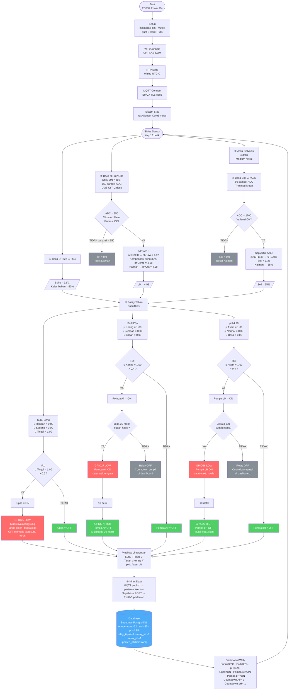

# Skema Detail — Tiga Parameter ke Aktuator

---

```mermaid
flowchart TD
    START([Start\nESP32 Power On]) --> INIT["Setup\ninisialisasi pin · mutex\nbuat 2 task RTOS"]

    INIT --> WIFI["WiFi Connect\nUPT-LAB-KOM"]
    WIFI --> NTP["NTP Sync\nWaktu UTC+7"]
    NTP --> MQTT_C["MQTT Connect\nEMQX TLS 8883"]
    MQTT_C --> READY["Sistem Siap\ntaskSensor Core1 mulai"]

    READY --> SIKLUS(["Siklus Sensor\ntiap 15 detik"])

    %% ══════════════════════════════════════
    %% BACA SENSOR
    %% ══════════════════════════════════════

    SIKLUS --> BDHT["① Baca DHT22 GPIO4"]
    BDHT --> VDHT[/Suhu = 32°C\nKelembaban = 60%/]

    SIKLUS --> BPH["② Baca pH GPIO34\nDMS ON 7 detik\n150 sampel ADC\nDMS OFF 2 detik"]
    BPH --> VDHT2{"ADC = 950\nTrimmed Mean\nVariansi OK?"}
    VDHT2 -->|TIDAK variansi > 150| VRESET["pH = 0.0\nReset Kalman"]
    VDHT2 -->|YA| VADC["adcToPH:\nADC 950 → phRaw = 4.97\nKompensasi suhu 32°C\nphComp = 4.98\nKalman → phOut = 4.98"]
    VADC --> VPH[/pH = 4.98/]

    SIKLUS --> JEDA["③ Jeda Galvanik\n4 detik\nmedium netral"]

    JEDA --> BSOIL["④ Baca Soil GPIO35\n50 sampel ADC\nTrimmed Mean"]
    BSOIL --> VSOIL2{"ADC = 2700\nVariansi OK?"}
    VSOIL2 -->|TIDAK| SRESET["Soil = 0.0\nReset Kalman"]
    VSOIL2 -->|YA| SADC["map ADC 2700:\n2900–1139 → 0–100%\nSoil = 11%\nKalman → 35%"]
    SADC --> VSOIL[/Soil = 35%/]

    %% ══════════════════════════════════════
    %% FUZZIFIKASI
    %% ══════════════════════════════════════

    VDHT & VPH & VSOIL --> FUZZY["⑤ Fuzzy Tahani\nFuzzifikasi"]

    FUZZY --> FS["Suhu 32°C
    µ Rendah = 0.00
    µ Sedang = 0.00
    µ Tinggi = 1.00"]

    FUZZY --> FSO["Soil 35%
    µ Kering = 1.00
    µ Lembab = 0.00
    µ Basah  = 0.00"]

    FUZZY --> FPH["pH 4.98
    µ Asam   = 1.00
    µ Normal = 0.00
    µ Basa   = 0.00"]

    %% ══════════════════════════════════════
    %% INFERENSI
    %% ══════════════════════════════════════

    FS --> R1{"R1:\nµ Tinggi = 1.00\n> 0.5 ?"}
    FSO --> R2{"R2:\nµ Kering = 1.00\n> 0.4 ?"}
    FPH --> R3{"R3:\nµ Asam = 1.00\n> 0.4 ?"}

    R1 -->|YA| KIFAS_ON["Kipas = ON"]
    R1 -->|TIDAK| KIFAS_OFF["Kipas = OFF"]
    R2 -->|YA| AIR_ON["Pompa Air = ON"]
    R2 -->|TIDAK| AIR_OFF["Pompa Air = OFF"]
    R3 -->|YA| PH_ON["Pompa pH = ON"]
    R3 -->|TIDAK| PH_OFF["Pompa pH = OFF"]

    %% ══════════════════════════════════════
    %% KONTROL RELAY
    %% ══════════════════════════════════════

    KIFAS_ON --> RK["GPIO25 LOW\nKipas nyala langsung\ntanpa timer · tanpa jeda\nOFF otomatis saat suhu turun"]

    AIR_ON --> CAIR{"Jeda 30 menit\nsudah habis?"}
    CAIR -->|YA| RAY["GPIO27 LOW\nPompa Air ON\ncatat waktu nyala"]
    CAIR -->|TIDAK| CDAIR["Relay OFF\nCountdown tampil\ndi dashboard"]
    RAY --> T10A["10 detik"]
    T10A --> RAYO["GPIO27 HIGH\nPompa Air OFF\nMulai jeda 30 menit"]

    PH_ON --> CPH{"Jeda 3 jam\nsudah habis?"}
    CPH -->|YA| RPH["GPIO26 LOW\nPompa pH ON\ncatat waktu nyala"]
    CPH -->|TIDAK| CDPH["Relay OFF\nCountdown tampil\ndi dashboard"]
    RPH --> T10P["10 detik"]
    T10P --> RPHO["GPIO26 HIGH\nPompa pH OFF\nMulai jeda 3 jam"]

    %% ══════════════════════════════════════
    %% STATUS & OUTPUT
    %% ══════════════════════════════════════

    RK & RAYO & RPHO & KIFAS_OFF & AIR_OFF & PH_OFF --> STATUS["/Kualitas Lingkungan\nSuhu  : Tinggi ✗\nTanah : Kering ✗\npH    : Asam   ✗/"]

    STATUS --> KIRIM["⑥ Kirim Data\nMQTT publish → pertanian/sensor\nSupabase POST → /rest/v1/pertanian"]

    KIRIM --> DB[("Database\nSupabase PostgreSQL\ntemperature=32 · soil=35 · ph=4.98\nrelay_kipas=1 · relay_air=1 · relay_ph=1\nupdated_at=timestamp")]

    DB --> DASH["Dashboard Web\nSuhu=32°C · Soil=35% · pH=4.98\nKipas=ON · Pompa Air=ON · Pompa pH=ON\nCountdown Air=-1 · Countdown pH=-1"]

    DASH --> SIKLUS

    style RAY fill:#ff6b6b,color:#fff
    style RPH fill:#ff6b6b,color:#fff
    style RK fill:#ff6b6b,color:#fff
    style RAYO fill:#51cf66,color:#fff
    style RPHO fill:#51cf66,color:#fff
    style KIFAS_OFF fill:#51cf66,color:#fff
    style AIR_OFF fill:#51cf66,color:#fff
    style PH_OFF fill:#51cf66,color:#fff
    style CDAIR fill:#868e96,color:#fff
    style CDPH fill:#868e96,color:#fff
    style VRESET fill:#868e96,color:#fff
    style SRESET fill:#868e96,color:#fff
    style DB fill:#4dabf7,color:#fff
```
