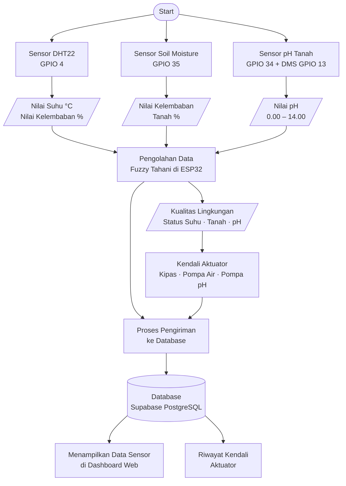
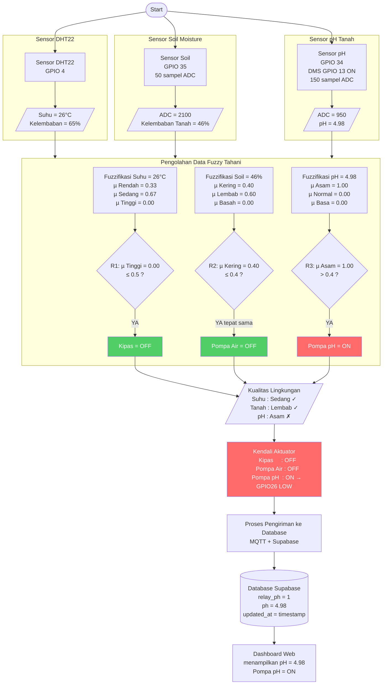
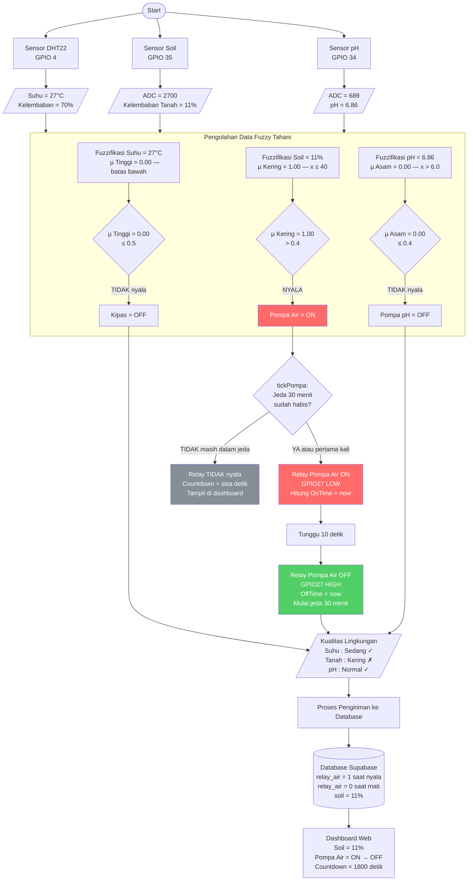
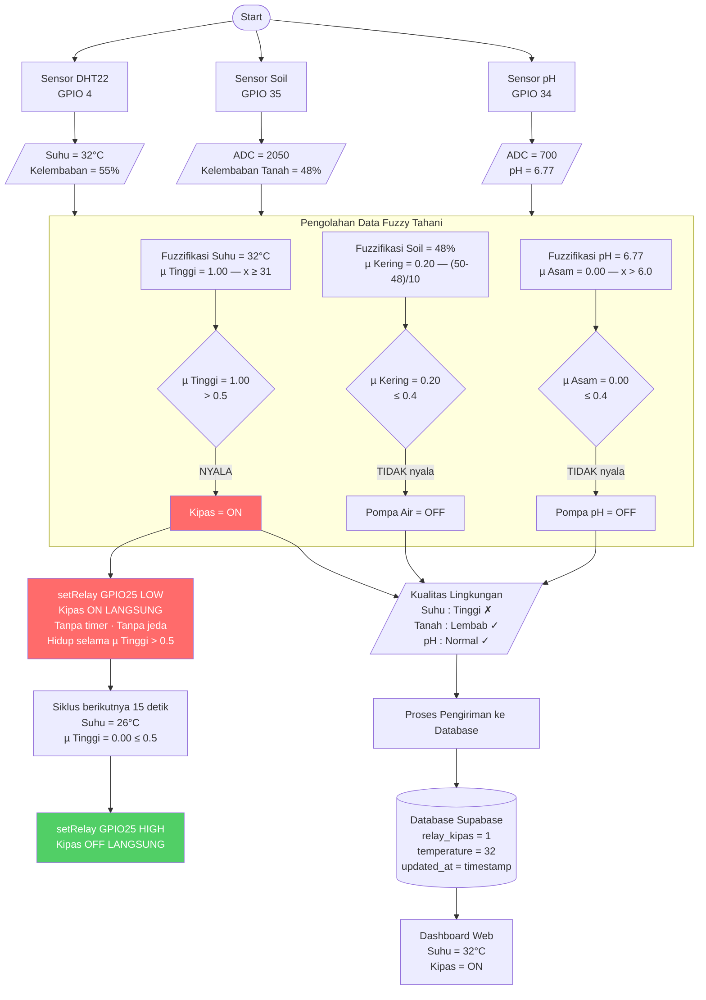
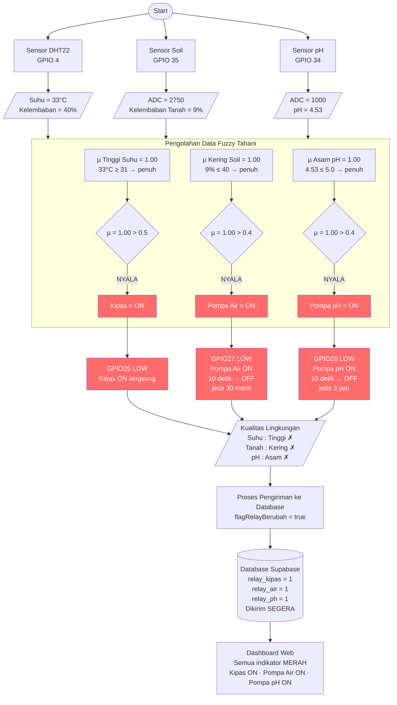
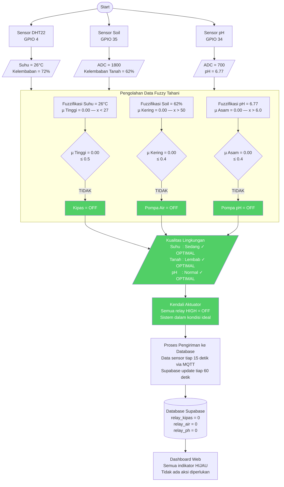
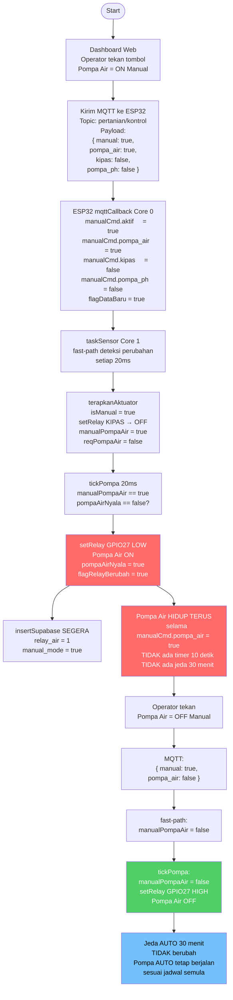
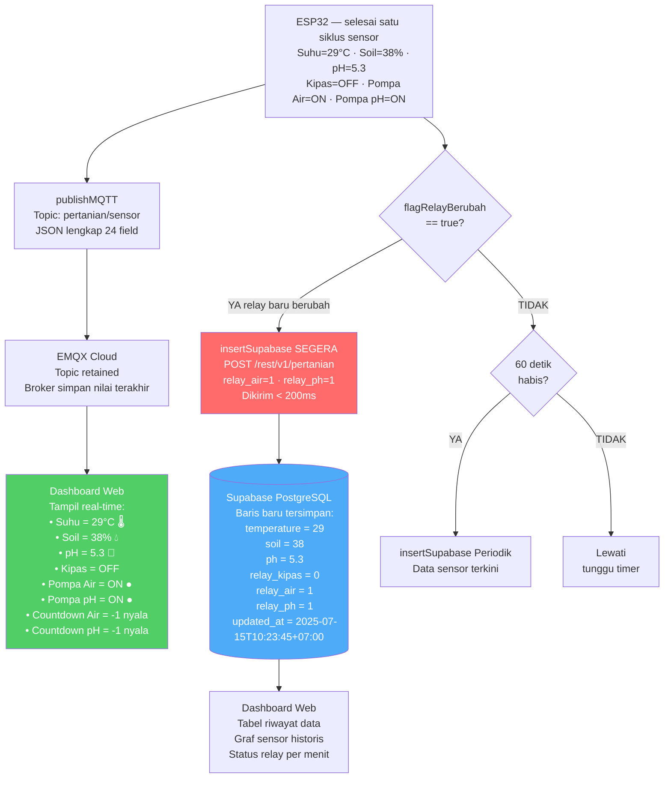
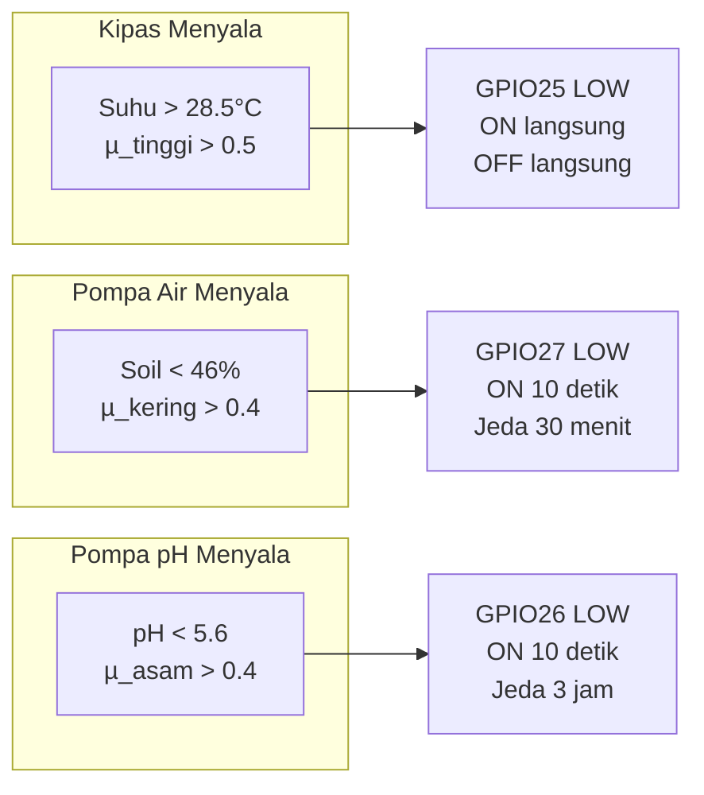

# Skema Pengujian Software — Sistem IoT Pertanian Cerdas Cabai Rawit

---

## Diagram 1: Skema Utama Alur Sistem (Mengacu Gambar)

---

## Diagram 2: Alur Lengkap dengan Nilai Nyata — Pengujian Kasus 1
### pH Asam (pH = 5.2) → Pompa pH Menyala

---

## Diagram 3: Pengujian Kasus 2
### Tanah Kering (Soil = 35%) → Pompa Air Menyala

---

## Diagram 4: Pengujian Kasus 3
### Suhu Tinggi (Suhu = 32°C) → Kipas Menyala

---

## Diagram 5: Pengujian Kasus 4
### Semua Kondisi Buruk → Semua Aktuator Menyala Bersamaan

---

## Diagram 6: Pengujian Kasus 5
### Kondisi Normal → Semua Aktuator OFF

---

## Diagram 7: Pengujian Kontrol Manual via Dashboard

---

## Diagram 8: Pengujian Data ke Database dan Dashboard

---

## Tabel Ringkasan Hasil Pengujian

| Kasus | Suhu (°C) | Soil (%) | pH | Kipas | Pompa Air | Pompa pH |
|-------|-----------|----------|----|-------|-----------|----------|
| 1 — pH Asam | 26 | 60 | **4.98** | OFF | OFF | **ON** |
| 2 — Tanah Kering | 27 | **11** | 6.86 | OFF | **ON** | OFF |
| 3 — Suhu Tinggi | **32** | 48 | 6.77 | **ON** | OFF | OFF |
| 4 — Semua Buruk | **33** | **9** | **4.53** | **ON** | **ON** | **ON** |
| 5 — Normal | 26 | 62 | 6.77 | OFF | OFF | OFF |
| 6 — Manual | bebas | bebas | bebas | sesuai perintah | **ON terus** | sesuai perintah |

**Batas nilai untuk setiap aktuator:**

---

*Skema pengujian ini menggambarkan alur sistem dari pembacaan sensor,*
*pengolahan Fuzzy Tahani, kendali aktuator, hingga penyimpanan ke database.*
