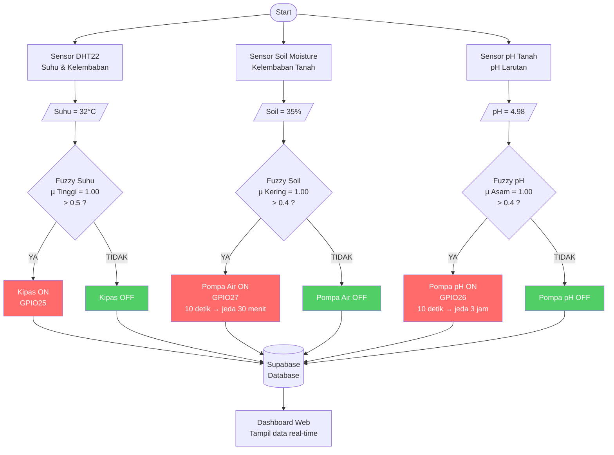

# Skema Sistem — Tiga Parameter ke Aktuator

---

## Batas Nilai Aktuator Menyala

| Parameter | Nilai | Aktuator | Durasi |
|-----------|-------|----------|--------|
| Suhu > **28.5°C** | µ_tinggi > 0.5 | Kipas ON | Selama kondisi terpenuhi |
| Soil < **46%** | µ_kering > 0.4 | Pompa Air ON | 10 detik, jeda 30 menit |
| pH < **5.6** | µ_asam > 0.4 | Pompa pH ON | 10 detik, jeda 3 jam |
